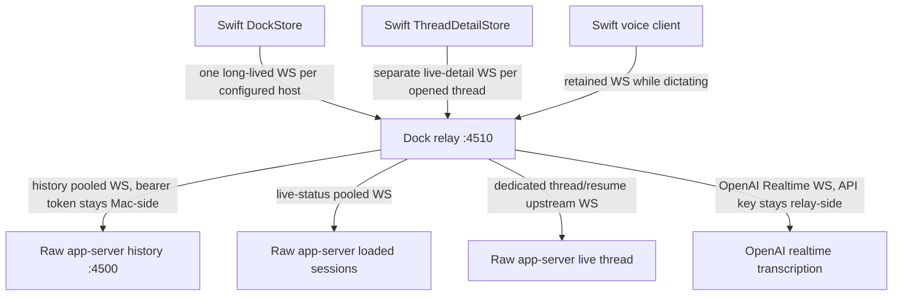
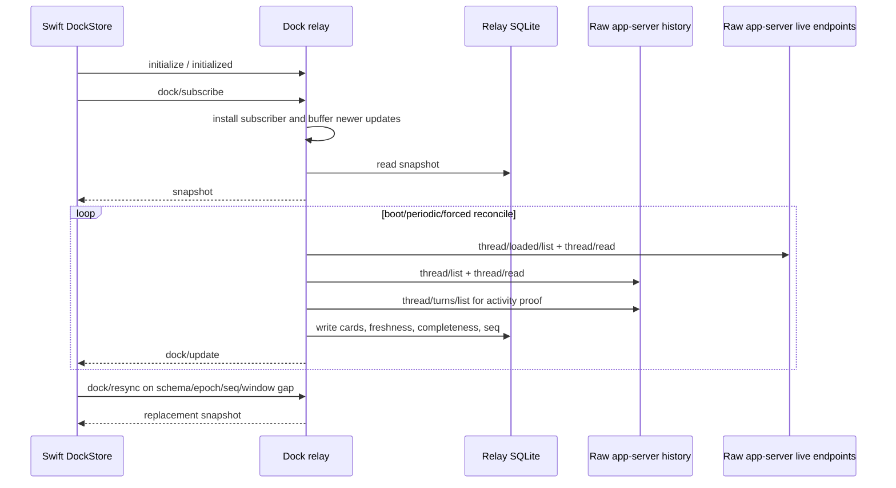
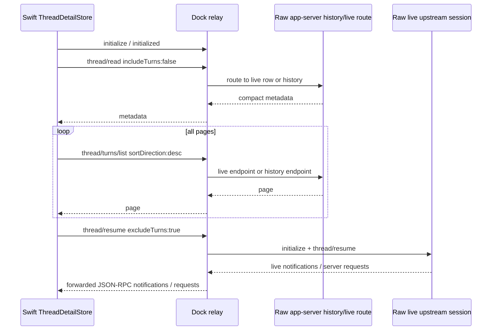
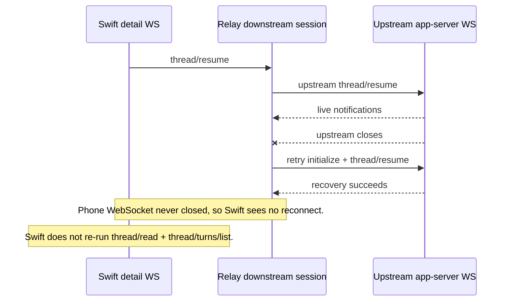

# Codex Dock Protocol And Update Architecture Reference

Date: 2026-05-31

Status: reference plus audit. This document describes the intended architecture,
the real update paths in the current repo, the app-server assumptions the relay
depends on, and the stale-data failure modes we found while auditing. It does
not implement fixes.

Current UX intention:
[CODEX_DOCK_USER_INTENTION_2026-06-01.md](CODEX_DOCK_USER_INTENTION_2026-06-01.md),
[CODEX_DOCK_TRUSTWORTHY_LIVE_WINDOW_INTENTION_2026-06-01.md](CODEX_DOCK_TRUSTWORTHY_LIVE_WINDOW_INTENTION_2026-06-01.md)
and
[CODEX_DOCK_LIVE_TRUTH_INTENTION_2026-06-01.md](CODEX_DOCK_LIVE_TRUTH_INTENTION_2026-06-01.md).

## Bottom Line

Codex Dock has two different update systems:

1. Dock and Archive cards are relay-owned streams. The relay polls and
   reconciles Codex app-server state into SQLite, then sends `dock/update` or
   `archive/update` to subscribed clients.
2. Thread Detail is a live forwarded session. The client reads historical turns,
   then asks the relay to `thread/resume`; the relay binds that phone WebSocket
   to an upstream app-server session and forwards live notifications and server
   requests.

The current test suite is strong at proving that Swift can apply pre-made
snapshots, deltas, and live notifications. It is weaker at proving that real
Codex work continues flowing from app-server to relay to phone over time. That
gap explains how the app can look connected while a thread or Dock list stops
updating.

The highest-signal stale-data failures found in this audit are:

- Dock can reconnect its WebSocket and re-run `initialize` without re-running
  `dock/subscribe`; the stream can look alive but stop receiving card updates.
- Thread Detail can miss history after relay-side upstream recovery because the
  relay may recover its Mac-side `thread/resume` session without closing the
  phone WebSocket; Swift only rehydrates detail when it observes reconnect,
  foreground resume, or stream end.
- Route health is not data freshness. `/readyz`, `/statusz`, `/routesz`,
  `/metricsz`, and `/syncz` can look healthy while cards are stale, partial, or
  no longer receiving updates.
- Relay subscribe-time buffering protects one race: the relay subscribes before
  reading the initial snapshot and buffers newer updates until the snapshot is
  returned. That does not protect reconnects that never re-send
  `dock/subscribe`.
- Most regular tests use fakes or scripted streams. Those tests prove client
  merge/render behavior, not the full real app-server -> relay -> iPhone update
  path.

## Source Audit Inputs

This writeup combines parent-agent code reads with six parallel read-only
audits covering app-server assumptions, relay state, Swift streams, Thread
Detail, tests, and reconnect/freshness failure modes. The parallel outputs were
used as evidence inputs; the file paths and code anchors below are the durable
reference.

## Vocabulary

- App-server: the raw Codex local JSON-RPC server, normally on
  `ws://127.0.0.1:4500`.
- Relay: the Dock relay process, normally on `:4510`. It owns the raw
  app-server bearer token and exposes the phone-safe Dock protocol.
- Client: the Swift iOS app.
- Downstream: relay -> phone/client.
- Upstream: relay -> raw Codex app-server.
- Snapshot: a full replacement card payload.
- Delta: an incremental card payload.
- Heartbeat: a stream payload kind Swift can accept, intended to update
  freshness without changing rows.
- Rehydrate: Thread Detail's full historical refresh:
  `thread/read includeTurns:false`, all pages of `thread/turns/list`, then
  `thread/resume excludeTurns:true`.
- Freshness: whether the relay believes card facts are current.
- Completeness: whether the relay believes it has the full relevant set/window.
- Live session: a `thread/resume` connection that can forward notifications,
  server requests, and turn commands.

## Non-Negotiable Architecture Rules

1. The phone normally talks to the relay on `:4510`, not directly to raw
   app-server on `:4500`.
2. Dock Home card truth comes from relay `dock/*` methods, not raw
   `thread/list`.
3. Archive card truth comes from relay `archive/*` methods.
4. Current legacy Thread Detail history comes from
   `thread/read includeTurns:false` plus paged `thread/turns/list`, with
   `thread/resume excludeTurns:true` as the live session and compact metadata
   path. After the proposed projection cutover, the relay may still use those
   raw routes internally, but phone display truth must come from
   `thread/detail/*`.
5. The relay, not Swift, owns card recency. Pre-cutover Swift renders relay
   `orderKey`; projection cutover Swift renders relay `displayOrderKey`. Swift
   must not rebuild card recency from local timestamps.
6. `thread/list` order is not a client-visible ordering contract. The relay must
   prove card activity with `thread/turns/list` before exposing fresh card
   order.
7. Route health is not freshness. A route can answer and still return stale or
   partial data.
8. Local client metadata can decorate rows and pin rows, but it must not create
   production thread rows or override projection `displayOrderKey` after
   cutover.
9. Human-started filtering is relay-owned. After projection cutover, filters
   that change visible membership are `viewParams` with a `viewParamsKey`;
   Swift's defensive second filter is an invalid-data guard only.
10. Any reconnect that changes stream/session identity must force the missing
    state to be rebuilt, not merely reconnect a socket.
11. A normal phone host config must identify relay hosts only. Saved app configs
    are a `hosts` list, and Swift rejects raw app-server port `4500` for normal
    app endpoints.

## Protocol Surface

Swift method constants live in `CodexDock/AppServer/AppServerMethods.swift`.
The relay dispatcher that decides what the phone can call lives in
`scripts/dock-relay.mjs`.

## Proposed Projection Identity Contract

Status: proposed permanent projection contract, not implemented yet. The
rationale and root-cause audit live in
`docs/CODEX_DOCK_THREAD_DETAIL_OUTBOUND_DUPLICATE_ROOT_CAUSE_2026-06-01.md`.

Projection supersession rule: after projection cutover, the sections below that
describe card-v2 `delta`, `stateGeneration`, `logicalHostID::threadID`,
`upsertCards`, `deleteCardIDs`, or raw Thread Detail display routes are
pre-cutover implementation history only. They are not co-equal display
contracts and cannot be used as production identity, ordering, or freshness
truth.

The permanent display source for Dock, Archive, and Thread Detail should be
relay-owned projection rows, not raw Codex JSON parsed independently by Swift
and proof scripts. Thread Detail is the first urgent cutover, but it must use
the same projection identity grammar as Dock and Archive.

### Shared Projection Identity Envelope

Every user-visible production row/card is a relay projection row. The shared
envelope is:

```json
{
  "schemaVersion": 1,
  "identityVersion": 1,
  "sourceHostID": "amir-m5",
  "view": "thread.detail",
  "threadID": "019e...",
  "projectionID": "host:amir-m5/thread:019e.../turn:t1/item:i1/row:userMessage",
  "sourceRef": "host:amir-m5/thread:019e.../turn:t1/item:i1",
  "rowRole": "userMessage",
  "revision": 7,
  "displayOrderKey": "9998239345599999|0000000000|9999999999|9999999999|...",
  "freshness": {
    "state": "fresh",
    "sourceWatermark": "codex-source-..."
  },
  "payload": {}
}
```

Required shared fields:

| Field | Meaning |
| --- | --- |
| `schemaVersion` | Projection DTO shape version. |
| `identityVersion` | Projection identity algorithm version. |
| `sourceHostID` | Stable Codex source identity; never derived from phone saved host config. |
| `view` | `dock`, `archive`, `archive.cleanup`, `host.registry`, or `thread.detail`. |
| `threadID` | Raw Codex thread ID when the row belongs to one thread. |
| `projectionID` | Stable visible row/card identity, generated only by the relay projection normalizer. |
| `sourceRef` | Stable raw Codex fact identity used to derive `projectionID`. |
| `rowRole` | Semantic visible role, such as `threadCard`, `userMessage`, `request`, or `system`. |
| `revision` | Content revision for the same `projectionID`; it is not identity. |
| `displayOrderKey` | Opaque relay-owned ascending sort key. |
| `freshness` | Data freshness for this projection row or view. |
| `payload` | Typed row payload for the specific view. |

Projection IDs include `sourceHostID`:

```text
host:<sourceHostID>/row:host
host:<sourceHostID>/thread:<threadID>/row:threadCard
host:<sourceHostID>/thread:<threadID>/turn:<turnID>/item:<itemID>/row:<rowRole>
host:<sourceHostID>/thread:<threadID>/request:<requestID>/row:request
host:<sourceHostID>/thread:<threadID>/system:<systemEventKind>/<sourceSequenceOrTimestamp>
host:<sourceHostID>/thread:<threadID>/diagnostic:<stableHash>/row:unknown
```

Dock and Archive use the same thread-card projection ID:

```text
host:<sourceHostID>/thread:<threadID>/row:threadCard
```

`view: "dock"` and `view: "archive"` scope where that card is delivered.
Archive state is payload state, not a separate identity namespace. The
Dock/Archive card `sourceRef` is:

```text
host:<sourceHostID>/thread:<threadID>
```

The current Dock contract has `logicalHostID`. In the post-cutover projection
contract, `logicalHostID` is a legacy/transition alias for `sourceHostID`.
If a legacy Dock payload still carries both names, they must map one-to-one.
If they disagree, the relay must emit a diagnostic or `resyncRequired`; Swift
must not pick one locally.

`projectionID` is the only production visible identity field. Older local names
such as `eventID` are historical aliases from the pre-projection Thread Detail
plan and must not remain as separate wire identity fields after cutover.

### Host Projection Rows

`host:<sourceHostID>/row:host` is the projection identity for a Codex source
host. Host rows carry labels and connectivity summaries; they do not define a
second host identity namespace.

Host row payload:

```json
{
  "sourceHostID": "amir-m5",
  "displayName": "Amir M5",
  "endpointLabels": ["amir-m5.fairy-salmon.ts.net:4510"],
  "connectivityState": "online",
  "lastContactAt": "2026-06-01T19:50:00.000Z"
}
```

Rules:

- host rows are keyed only by `sourceHostID`;
- endpoint, Bonjour, LAN, Tailscale, and saved-phone labels are payload labels,
  never identity;
- phone saved host configs are bootstrap connection records only. They may have
  local config IDs for settings UI, but those IDs never appear in
  `sourceHostID`, `sourceRef`, `projectionID`, `displayOrderKey`, or proof
  witnesses;
- thread-card rows reference the host row through `sourceHostID`;
- host row ordering is stable label order unless a future host view defines a
  relay-owned `displayOrderKey`.

Host Registry routes use the same projection grammar:

- `host/registry/read`
- `host/registry/subscribe`
- `host/registry/update`
- `host/registry/resync`

`HostRegistrySnapshotDTO` and `HostRegistryUpdateDTO` are shared
snapshot/update envelopes with `view: "host.registry"` and host-row payloads.
If the app shows configured endpoints before a relay connection exists, that is
settings UI backed by phone config, not a projection view and not evidence of
Codex source identity. Once connected, user-visible Codex source identity,
labels, connectivity summaries, and proof state come from host projection rows.

### `sourceHostID` Derivation

The relay derives `sourceHostID` with this ordered rule:

1. Use non-empty `CODEX_DOCK_REAL_HOST_ID` from relay-side configuration.
2. Else use the persisted value in `.codex-dock/source-host-id`.
3. Else create `.codex-dock/source-host-id` once as
   `local-<sha256(platform + user + CODEX_HOME + historyUrl)[0..12]>`.

Validation:

- The value must match `[A-Za-z0-9][A-Za-z0-9._-]{0,63}`.
- Endpoint hostnames, Bonjour names, LAN IPs, Tailscale names, saved phone host
  config, WebSocket connection IDs, and relay process IDs are not
  `sourceHostID`.
- Phone saved host config IDs must not appear in `sourceHostID`, `sourceRef`,
  `projectionID`, `displayOrderKey`, or proof witnesses.
- `CODEX_DOCK_RELAY_INSTANCE_ID` is process/session identity only. It must not
  be used in `projectionID`.
- Test fixtures may set explicit `sourceHostID` values, but they must still use
  the same projection ID grammar.

This makes identity stable across endpoint relabeling while still allowing
separate Mac/home Codex sources to stay distinct.

### Single Projection Engine Module

The relay has one production projection engine module:

```text
scripts/dock-relay-projection-engine.mjs
```

That module, or its owned package directory, is the only production place where
helpers named like `projectionIDFor*`, `sourceRefFor*`, row-role mappers,
`displayOrderKeyFor*`, or projection-engine version constants may live. Thread
Detail ledger code, Dock state code, Archive state code, Host Registry code,
Archive Cleanup code, and proof fixtures may call the engine; they must not
fork visible identity or ordering logic.

Tests may import the pure engine for unit coverage. Acceptance proof may not
use that import as its expected-ID oracle. Acceptance proof reads IDs from
emitted projection envelopes only.

### Shared Projection Snapshot And Update Grammar

Each display route emits one shared stream grammar:

```json
{
  "schemaVersion": 1,
  "identityVersion": 1,
  "projectionEngineVersion": 1,
  "sourceHostID": "amir-m5",
  "view": "thread.detail",
  "threadID": "019e...",
  "epoch": "projection-...",
  "seq": 42,
  "scope": "thread",
  "complete": true,
  "freshness": {
    "state": "fresh",
    "asOf": "2026-06-01T18:00:00.000Z",
    "sourceWatermark": "codex-source-..."
  },
  "rows": []
}
```

Updates are only:

- `snapshot`: replace the declared scope.
- `upsert`: insert or replace rows by `projectionID`.
- `delete`: remove rows by `projectionID`.
- `heartbeat`: prove stream continuity without mutating rows.
- `resyncRequired`: declare continuity broken and require a replacement
  snapshot.

Every update carries `epoch` and monotonic `seq`. Swift applies only the active
epoch and increasing sequence. `seq` is the canonical wire field; do not add a
parallel `sequence` field for projection streams. Sequence gaps, missing
epochs, missing `projectionEngineVersion`, or schema/identity/engine version
mismatches mark the view stale until resync succeeds.

Every projection snapshot and update envelope carries
`projectionEngineVersion`. Swift stores the active engine version with the
active epoch. An update with a different `projectionEngineVersion` inside the
same epoch is invalid; the client rejects it, marks the view stale, and requests
the matching resync route. A new engine version is accepted only through a
replacement snapshot with a new epoch.

Route-specific notification methods carry this same update grammar:

| View | Subscribe/read routes | Passive update notification | Resync route |
| --- | --- | --- | --- |
| Dock | `dock/subscribe` | `dock/update` | `dock/resync` |
| Archive | `archive/subscribe` | `archive/update` | `archive/resync` |
| Archive Cleanup | `archive/cleanup/read`, `archive/cleanup/subscribe` | `archive/cleanup/update` | `archive/cleanup/resync` |
| Host Registry | `host/registry/read`, `host/registry/subscribe` | `host/registry/update` | `host/registry/resync` |
| Thread Detail | `thread/detail/read`, `thread/detail/subscribe` | `thread/detail/update` | `thread/detail/resync` |

The notification method name is transport routing only. Identity, ordering,
freshness, epoch, and sequence semantics come from the shared projection
payload, not from view-specific client code.

`heartbeat` updates carry `kind`, `schemaVersion`, `identityVersion`,
`projectionEngineVersion`, `sourceHostID`, `view`, `threadID` when scoped to
one thread, `epoch`, `seq`, and `freshness`. They carry no `rows`,
`projectionIDs`, or payload
mutation. A heartbeat proves stream continuity only; it never marks failed data
fresh.

### Cross-View Scope And Snapshot Authority

Accepted projection scopes:

| View | Scope | Snapshot authority |
| --- | --- | --- |
| `dock` | `view` | Complete active Dock view for one `viewParamsKey`; absent rows are deleted. |
| `archive` | `view` | Complete Archive view for one `viewParamsKey`; absent rows are deleted. |
| `archive.cleanup` | `view` | Complete Archive Cleanup candidate view for one `viewParamsKey`; absent rows are deleted. |
| `dock` | `host` | Complete active Dock view for one `sourceHostID` and `viewParamsKey`. |
| `archive` | `host` | Complete Archive view for one `sourceHostID` and `viewParamsKey`. |
| `archive.cleanup` | `host` | Complete cleanup candidate view for one `sourceHostID` and `viewParamsKey`. |
| `dock` / `archive` / `archive.cleanup` | `window` | Bounded `displayOrderKey` range; only rows inside the declared range are replaced. |
| `host.registry` | `view` | Complete host registry for one `viewParamsKey`; absent host rows are deleted. |
| `thread.detail` | `thread` | Complete detail view for one `threadID` and `viewParamsKey`. |
| `thread.detail` | `window` | Bounded detail `displayOrderKey` range for one thread. |

Dock and Archive stream envelopes omit `threadID` unless the update is
explicitly scoped to one thread. Card rows carry thread identity in the row
envelope when present and always in the typed payload. Clients determine
snapshot authority from `view`, `scope`, `sourceHostID`, `viewParamsKey`, and
window bounds, not by guessing from row IDs.

For every view, `snapshot` replaces only its declared scope, `upsert` replaces
exact `projectionID`s, `delete` removes exact `projectionID`s, `heartbeat`
proves continuity only, and `resyncRequired` makes the active view stale until
the matching resync route returns a replacement snapshot.

### Dock And Archive Projection DTOs

Dock and Archive use the same required-field rigor as Thread Detail. The route
names remain `dock/*` and `archive/*`, but the payload is the shared projection
contract.

`DockSnapshotDTO` and `ArchiveSnapshotDTO`:

```json
{
  "kind": "snapshot",
  "schemaVersion": 1,
  "identityVersion": 1,
  "projectionEngineVersion": 1,
  "sourceHostID": "amir-m5",
  "view": "dock",
  "epoch": "projection-...",
  "seq": 1,
  "scope": "view",
  "viewParamsKey": "sha256:...",
  "complete": true,
  "order": "displayOrderKeyAscending",
  "freshness": {
    "state": "fresh"
  },
  "rows": []
}
```

`DockUpdateDTO` and `ArchiveUpdateDTO`:

```json
{
  "kind": "upsert",
  "schemaVersion": 1,
  "identityVersion": 1,
  "projectionEngineVersion": 1,
  "sourceHostID": "amir-m5",
  "view": "dock",
  "epoch": "projection-...",
  "seq": 2,
  "scope": "view",
  "viewParamsKey": "sha256:...",
  "order": "displayOrderKeyAscending",
  "rows": [],
  "projectionIDs": []
}
```

Required fields by update kind are the same as Thread Detail, except
Dock/Archive envelopes omit `threadID` unless the update is explicitly scoped
to one thread. `delete` uses `projectionIDs`; card streams do not have
`deleteCardIDs`. `upsert` uses `rows`; card streams do not have `upsertCards`.

Thread-card row payload:

```json
{
  "threadID": "019e...",
  "backendSessionID": "019e...",
  "title": "Hill climb experiment",
  "displaySummary": "Current work summary",
  "status": "running",
  "sourceKind": "human",
  "lane": "human",
  "archiveState": "active",
  "repository": "codex-client",
  "workingDirectory": "/Users/aelaguiz/workspace/codex-client",
  "branch": "main",
  "activityAt": "2026-06-01T19:50:00.000Z",
  "activityAtMs": 1780343400000,
  "relationship": "root",
  "forkedFromID": null,
  "hostDisplayName": "Amir M5",
  "hostEndpoint": "amir-m5.fairy-salmon.ts.net:4510"
}
```

The card `projectionID` is:

```text
host:<sourceHostID>/thread:<threadID>/row:threadCard
```

Dock and Archive thread-card `displayOrderKey` is:

```text
<invertedActivityMillis>|<statusPriority>|<safeProjectionID>
```

Field rules:

- `activityMillis` is the relay-proven newest activity time for the thread.
- `invertedActivityMillis = 9999999999999999 - activityMillis`, left-padded to
  16 decimal digits.
- `statusPriority` is left-padded to 4 decimal digits and is relay-owned.
- `safeProjectionID` is the canonical escaped `projectionID` tie breaker.
- Swift compares the full string only; it never parses it back into fields.

Normative `statusPriority` values:

| Card status | Priority |
| --- | --- |
| `needsInput` | `0000` |
| `needsApproval` | `0000` |
| `running` | `0001` |
| `idle` | `0002` |
| `error` | `0003` |
| `unknown` | `0004` |
| any unrecognized active status | `0004` |
| `dormant` / not loaded | `0005` |

### Archive Cleanup Projection View

Archive Cleanup is its own relay-projected view:

```text
view: "archive.cleanup"
```

Routes:

- `archive/cleanup/read`
- `archive/cleanup/subscribe`
- `archive/cleanup/update`
- `archive/cleanup/resync`

Archive Cleanup rows use the same `threadCard` row payload and the same card
`projectionID` as Dock and Archive:

```text
host:<sourceHostID>/thread:<threadID>/row:threadCard
```

Cleanup membership is view membership, not row identity. The cleanup view
selects active cleanup candidates through relay-owned `viewParams`:

```json
{
  "viewParams": {
    "candidateSource": "activeDock",
    "hostIDs": null,
    "statusKinds": null,
    "olderThan": null,
    "repositorySearch": "",
    "branchSearch": "",
    "textSearch": "",
    "includeDiagnostics": true,
    "sort": "displayOrderKeyAscending"
  }
}
```

`viewParamsKey` is required on every Archive Cleanup snapshot/update. Proof for
Archive Cleanup compares simulator UI to `view: "archive.cleanup"` witness
envelopes with the same `viewParamsKey`. It never treats a raw Dock stream or a
client-filtered Dock list as cleanup truth.

### Projection Cache Version And Contract Gate

The relay SQLite cache is a materialized projection, not a source of truth.
Every stored projection row is valid only for this cache version:

```text
schemaVersion + identityVersion + projectionEngineVersion + sourceHostID
```

If any part changes, rows for that host/view are invalid until rebuilt from raw
Codex state. The relay may keep old rows visible only as explicitly stale rows;
it must not serve them as fresh under a new identity contract.

The protocol contract source is a schema/generator package:

- one schema source for the shared projection envelope.
- typed payload schemas for Dock/Archive cards and Thread Detail rows.
- one accepted wire shape: projection envelope plus nested typed `payload`.
- `viewParams` and `viewParamsKey` schema for filtered projection views.
- generated or schema-checked Swift DTOs.
- Node validation for emitted projection snapshots/updates in tests.
- fixture corpus generated from the relay projection normalizer and consumed by
  Swift tests.

Normative package shape:

```text
contract/projection/projection-envelope.schema.json
contract/projection/projection-snapshot.schema.json
contract/projection/projection-update.schema.json
contract/projection/payloads/dock-thread-card.schema.json
contract/projection/payloads/thread-detail-row.schema.json
contract/projection/payloads/host-row.schema.json
contract/projection/fixtures/*.json
scripts/dock-relay-projection-engine.mjs
scripts/generate-projection-contract.mjs
scripts/check-projection-contract.mjs
CodexDock/AppServer/ProjectionDTO.swift
```

The existing `contract/dock/dock-thread-card.schema.json` becomes card-v2
history after cutover. It is not a co-equal phone-facing display schema.

This is a contract gate, not a linter. If identity version, route grammar, enum
vocabulary, payload shape, or projection row fields change, Node and Swift tests
must fail until the single source and fixtures move together.

`revision`, `schemaVersion`, `identityVersion`, and
`projectionEngineVersion` are separate:

| Field | Bump when |
| --- | --- |
| `revision` | Content, freshness, render state, request status, or payload changes for the same `projectionID`. |
| `schemaVersion` | Projection wire shape changes. |
| `identityVersion` | `sourceRef` or `projectionID` rules change. |
| `projectionEngineVersion` | Projection membership, order, freshness, row roles, view params, or payload interpretation changes without a wire-shape or ID-grammar change. |

`revision` is monotonic per `projectionID` inside one cache contract. Cache
validity uses
`schemaVersion + identityVersion + projectionEngineVersion + sourceHostID`, not
`revision`.

For a given `projectionID`, these envelope fields are immutable inside one
identity version:

- `sourceHostID`
- `sourceRef`
- `rowRole`
- `threadID` when present
- `view`
- `schemaVersion`
- `identityVersion`

If an `upsert` repeats a `projectionID` with any of those fields changed, the
client rejects the update, marks the view stale, and requests resync. If an
`upsert` regresses `revision` inside the same epoch, the client rejects it as
stale or requests resync. If the same `revision` carries different payload
content, the client treats it as a projection contract violation and requests
resync.

`epoch` is a relay-generated stream generation identifier. It is unique within
`sourceHostID + view + scope + viewParamsKey` and is created by the relay when a
projection stream starts, resyncs after stale state, changes
`identityVersion`, changes `projectionEngineVersion`, or detects unrecoverable
sequence/source loss. A new `epoch` is valid only when delivered with a
replacement snapshot. Updates cannot silently hop epochs.

`sourceWatermark` is upstream freshness evidence, not row identity. It records
the raw Codex history/live point the relay has normalized into the projection
ledger. Swift may display or log it as freshness context, but it cannot use it
to create, sort, dedupe, or delete rows. If the relay cannot prove a watermark
is still compatible with the current projection cache contract, the affected
view is stale until resync.

### Projection Identity Laws

1. No production visible row/card ID may be generated from body text, timestamp,
   local UI state, Swift object lifetime, raw WebSocket request ID alone,
   `UUID()`, or `crypto.randomUUID()`.
2. A supported raw Codex item without enough identity does not become a normal
   message/card row. It becomes a stable diagnostic row or a `resyncRequired`
   update.
3. Live, history, reconnect, canonical reread, server request, request
   resolution, cache rebuild, and proof paths all call the same relay projection
   normalizer.
4. Streaming and settled forms of one Codex item share one `projectionID`.
5. Request controls are attached to the same `projectionID` as their visible
   row. `requestID` is only the response-routing key.
6. Sorting is by relay `displayOrderKey` only.
7. Local metadata can decorate projection rows, but it cannot create fresh
   production rows or override projection identity/order/freshness.
8. Diagnostics and health routes can explain state, but cannot be accepted as
   data truth for the UI.
9. Test fixtures must use projection DTOs or the relay projection normalizer.
10. Proof scripts must compare UI state against relay projection snapshots or
    updates, not against an independent reconstruction of raw Codex truth.
11. Filters are projection view parameters. Every filtered view has a
    `viewParamsKey`, and proof compares UI only to the relay projection view
    with the same key.
12. Pin and local metadata can decorate existing projection rows, or request a
    future relay-owned pinned projection view with explicit `viewParamsKey`.
    Swift cannot use local pin state to create a second row order, second
    membership set, or alternate cache of projection rows.

### Projection Witness Plane

Acceptance proof compares simulator accessibility state to a retained witness
of relay-emitted projection snapshots and updates from the system under test.

Required capture mechanism:

- primary path: the proof harness attaches a projection witness recorder to the
  actual downstream JSON-RPC projection stream for the simulator app session
  before opening the UI; or
- the proof harness reads a loopback-only relay diagnostic export, for example
  `projection/witness/read`, for the exact `sourceHostID`, `view`, `scope`,
  `threadID`, `viewParamsKey`, and `epoch` under test.

The diagnostic export is not a display route. It may export only projection
envelopes already emitted by the relay projection engine for that session. It
must not compute expected IDs from fixture input.

`projection/witness/read` is acceptable only if it returns byte-for-byte
equivalent projection envelopes retained from the downstream emitter or a
retained emitter log. It must not rebuild expected rows from SQLite, raw Codex
payloads, fixture JSON, or helper imports at proof time. If downstream capture
and diagnostic export disagree, downstream capture wins and the run fails.

Allowed witness sources:

- the same downstream WebSocket projection snapshots/updates delivered to the
  simulator app;
- a relay debug export of the active projection ledger for the exact
  `sourceHostID`, `view`, `scope`, `threadID`, and `viewParamsKey`;
- structured relay logs that retain the emitted projection envelope while
  redacting prompt/body text where required.

Forbidden witness sources:

- fixture code that calls projection helper functions to construct expected
  IDs beside the relay;
- raw `thread/read`, `thread/turns/list`, or `thread/resume` truth rebuilt into
  expected UI IDs;
- `expectedMessageEventIDs`;
- `expectedMessageProjectionIDs` unless populated directly from the retained
  projection witness stream.
- fixture imports of `projectionIDForItem`, `projectionIDForRequest`, or any
  equivalent helper to populate acceptance expected IDs.

Proof records must name the witness:

```json
{
  "projectionWitness": {
    "source": "downstream-projection-stream",
    "sourceHostID": "amir-m5",
    "view": "thread.detail",
    "scope": "thread",
    "threadID": "019e...",
    "viewParamsKey": "sha256:...",
    "epoch": "projection-...",
    "lastSeq": 42,
    "projectionIDs": []
  }
}
```

Loopback-only witness export contract:

`projection/witness/read` request:

```json
{
  "sourceHostID": "amir-m5",
  "view": "thread.detail",
  "scope": "thread",
  "threadID": "019e...",
  "viewParamsKey": "sha256:...",
  "epoch": "projection-...",
  "fromSeq": 1,
  "throughSeq": null
}
```

Response:

```json
{
  "source": "retained-downstream-emitter-log",
  "byteEquivalentToDownstream": true,
  "sourceHostID": "amir-m5",
  "view": "thread.detail",
  "scope": "thread",
  "threadID": "019e...",
  "viewParamsKey": "sha256:...",
  "epoch": "projection-...",
  "lastSeq": 42,
  "envelopes": [],
  "projectionIDs": []
}
```

Rules:

- `projection/witness/read` is not in the phone production display allow-list.
- It is loopback/local-test only and must fail closed outside test/diagnostic
  configuration.
- `envelopes` are retained emitted projection snapshots/updates, not
  recomputed projections.
- `byteEquivalentToDownstream` must be `true`; otherwise proof cannot use this
  route as witness evidence.
- `projectionIDs` are derived from `envelopes` by reading emitted row IDs only.

### Command And Pending Row Rule

Mutation routes such as `turn/start`, `turn/steer`, `turn/interrupt`,
`thread/archive`, `thread/unarchive`, and server-request responses are commands.
They are not display-truth routes.

Projection v1 intentionally does not include Swift-created optimistic display
rows. If the product later chooses optimistic rows, they must be relay-owned and
specified as a contract extension before implementation:

```text
clientMutationID -> relay pending projection row -> atomic supersession to canonical sourceRef/projectionID
```

That extension must define an atomic supersession update or an equivalent
snapshot replacement. Swift must never create a production visible pending row
from local text, local timestamps, or local UUIDs.

If optimistic rows are added, the contract must specify `clientMutationID`, the
relay-created pending `projectionID`, the supersession/replacement operation,
proof that pending and canonical rows never render together, and cache rules
for pending rows on reconnect, failed send, and relay restart.

Proposed downstream display routes:

- `thread/detail/read`
- `thread/detail/subscribe`
- `thread/detail/update`
- `thread/detail/resync`

Request params:

```json
{
  "threadId": "019e...",
  "window": {
    "offset": 0,
    "limit": 250,
    "afterDisplayOrderKey": null
  }
}
```

`thread/detail/read` returns one `ThreadDetailSnapshotDTO`.
`thread/detail/subscribe` accepts the same params, returns an initial
`ThreadDetailSnapshotDTO`, then emits JSON-RPC notifications with method
`thread/detail/update` and params shaped as `ThreadDetailUpdateDTO`.
`thread/detail/update` is passive; the phone never calls it as a request.
`thread/detail/resync` accepts the same params plus optional `epoch` and
`reason` fields, and returns a replacement `ThreadDetailSnapshotDTO`.

`thread/detail/subscribe` also establishes the relay-side thread binding for
`turn/start`, `turn/steer`, and `turn/interrupt` on that downstream connection.
Internally, the relay may open or maintain upstream `thread/resume
excludeTurns:true`, but raw notifications from that upstream session are
normalized into projection updates before reaching Swift display state.

Existing raw `thread/read`, `thread/turns/list`, and `thread/resume` may remain
relay internals and command/session tools, but they must not be accepted as
production Thread Detail display proof after this contract is implemented.

### ThreadDetailEventDTO

Each visible Thread Detail row is one projection row envelope with a
Thread Detail payload. The flattened shape that existed during pre-cutover
Thread Detail work is not accepted after projection cutover.

```json
{
  "schemaVersion": 1,
  "identityVersion": 1,
  "sourceHostID": "amir-m5",
  "view": "thread.detail",
  "threadID": "019e...",
  "projectionID": "host:amir-m5/thread:019e.../turn:t1/item:i1/row:userMessage",
  "sourceRef": "host:amir-m5/thread:019e.../turn:t1/item:i1",
  "rowRole": "userMessage",
  "revision": 7,
  "displayOrderKey": "9998239345599999|0000000000|9999999999|9999999999|host%3Aamir-m5%2Fthread%3A019e...",
  "freshness": {
    "state": "fresh",
    "sourceWatermark": "codex-source-..."
  },
  "payload": {
    "turnID": "t1",
    "itemID": "i1",
    "itemType": "userMessage",
    "renderKind": "userMessage",
    "visibility": "message",
    "title": "User message",
    "body": "message text",
    "eventTime": "2026-06-01T17:30:00.000Z",
    "activityTime": "2026-06-01T17:30:00.000Z",
    "turnOrder": 0,
    "itemOrder": 0,
    "rowOrder": 0,
    "renderState": "settled",
    "requestID": null,
    "diagnostic": null
  }
}
```

Required row-role mapping:

| `rowRole` | `renderKind` | `visibility` |
| --- | --- | --- |
| `userMessage` | `userMessage` | `message` |
| `agentMessage` | `agentMessage` | `message` |
| `plan` | `agentMessage` | `thinking` |
| `reasoning` | `agentMessage` | `thinking` |
| `command` | `command` | `tooling` |
| `commandOutput` | `output` | `tooling` |
| `fileChange` | `request` | `request` |
| `toolCall` | `command` | `tooling` |
| `request` | `request` | `request` |
| `system` | `system` | `system` |
| `unknown` | `unknown` | `unknown` |

### Thread Detail View Params

`thread/detail/read`, `thread/detail/subscribe`, and `thread/detail/resync` use
the same `viewParams` shape when the visible Thread Detail view is filtered:

```json
{
  "threadID": "019e...",
  "viewParams": {
    "visibility": "all",
    "rowRoles": null,
    "search": "",
    "includeDiagnostics": true,
    "sort": "displayOrderKeyAscending"
  }
}
```

The relay echoes `viewParamsKey` on every snapshot and update. `viewParamsKey`
is stable-key-order JSON over `viewParams`, hashed as `sha256:<hex>`. Swift
rejects updates whose `viewParamsKey` does not match the active view.

Defaults:

- `visibility: "all"`; no hidden default message-only filter.
- `rowRoles: null`; non-empty arrays are positive include filters.
- `search: ""`; non-empty search is part of the relay projection view, not a
  local proof oracle.
- `includeDiagnostics: true` in development proof.
- `sort: "displayOrderKeyAscending"`; no other v1 sort is accepted.

### Dock And Archive View Params

`dock/subscribe`, `dock/resync`, `archive/subscribe`, and `archive/resync` use
the same projection-filter pattern. Defaults mean "include every row belonging
to this view," not a hidden product filter:

```json
{
  "viewParams": {
    "hostIDs": null,
    "lanes": null,
    "sourceKinds": null,
    "statusKinds": null,
    "branchSearch": "",
    "repositorySearch": "",
    "textSearch": "",
    "includeDiagnostics": true,
    "sort": "displayOrderKeyAscending"
  }
}
```

Rules:

- `null` arrays mean no filter. Non-empty arrays are positive include filters.
- `statusKinds: null` includes every status, including `idle`.
- Any search string that changes visible membership participates in
  `viewParamsKey`.
- Dock and Archive membership is selected by `view` and
  `projection_view_memberships`, not by Swift filtering one broad card list into
  separate screens.

### ThreadDetailSnapshotDTO

`thread/detail/read`, `thread/detail/resync`, and `ThreadDetailUpdateDTO` with
`kind: "snapshot"` return the same snapshot shape:

```json
{
  "schemaVersion": 1,
  "identityVersion": 1,
  "projectionEngineVersion": 1,
  "sourceHostID": "amir-m5",
  "view": "thread.detail",
  "threadID": "019e...",
  "epoch": "projection-...",
  "seq": 1,
  "snapshotID": "detail-snapshot-...",
  "sourceWatermark": "codex-source-...",
  "scope": "thread",
  "viewParamsKey": "sha256:...",
  "window": null,
  "rows": [],
  "complete": true,
  "nextCursor": null
}
```

Required fields:

| Field | Meaning |
| --- | --- |
| `schemaVersion` | Snapshot DTO shape version. |
| `identityVersion` | Projection identity algorithm version used for all rows. |
| `projectionEngineVersion` | Projection engine behavior version used for membership, order, freshness, row roles, view params, and payload interpretation. |
| `sourceHostID` | Stable Codex source host identity used in every `projectionID`. |
| `view` | Always `thread.detail` for Thread Detail snapshots. |
| `threadID` | Thread represented by the snapshot. |
| `epoch` | Relay projection epoch. New epoch replaces local ledger. |
| `seq` | Monotonic update sequence inside `epoch`. |
| `snapshotID` | Unique snapshot payload id for diagnostics. |
| `sourceWatermark` | Upstream Codex history/live point normalized by relay. |
| `scope` | `thread` or `window`. |
| `viewParamsKey` | Canonical key for the relay-filtered view this snapshot proves. |
| `window` | Required when `scope` is `window`; otherwise null. |
| `rows` | Ordered Thread Detail projection rows. |
| `complete` | Whether this response is complete for its declared scope. |
| `nextCursor` | Cursor for additional rows, or null. |

Window snapshots use this `window` shape:

```json
{
  "order": "displayOrderKeyAscending",
  "offset": 0,
  "limit": 250,
  "firstDisplayOrderKey": "9998239345599999|...",
  "lastDisplayOrderKey": "9998239345601234|...",
  "completeBefore": true,
  "completeAfter": false
}
```

Client rules for `scope: "window"`:

- If any `window` field is missing, the snapshot is invalid and the client must
  request `thread/detail/resync`.
- Replace only rows for the same `threadID` whose `displayOrderKey` is between
  `firstDisplayOrderKey` and `lastDisplayOrderKey`, inclusive.
- Retain rows outside that key range.
- Delete rows inside that key range when they are absent from the snapshot.
- `completeBefore` and `completeAfter` describe whether more rows exist before
  or after the returned key range in display order.
- Do not infer bounds from row count, `offset`, or `nextCursor` alone.

### ThreadDetailUpdateDTO

`thread/detail/subscribe` emits JSON-RPC notifications with method
`thread/detail/update`. Notification params are `ThreadDetailUpdateDTO` values.

```json
{
  "kind": "snapshot",
  "schemaVersion": 1,
  "identityVersion": 1,
  "projectionEngineVersion": 1,
  "sourceHostID": "amir-m5",
  "view": "thread.detail",
  "threadID": "019e...",
  "epoch": "projection-...",
  "seq": 1,
  "scope": "thread",
  "viewParamsKey": "sha256:...",
  "window": null,
  "rows": [],
  "complete": true,
  "nextCursor": null
}
```

```json
{
  "kind": "upsert",
  "schemaVersion": 1,
  "identityVersion": 1,
  "projectionEngineVersion": 1,
  "sourceHostID": "amir-m5",
  "view": "thread.detail",
  "threadID": "019e...",
  "epoch": "projection-...",
  "seq": 2,
  "viewParamsKey": "sha256:...",
  "rows": []
}
```

```json
{
  "kind": "delete",
  "schemaVersion": 1,
  "identityVersion": 1,
  "projectionEngineVersion": 1,
  "sourceHostID": "amir-m5",
  "view": "thread.detail",
  "threadID": "019e...",
  "epoch": "projection-...",
  "seq": 3,
  "viewParamsKey": "sha256:...",
  "projectionIDs": []
}
```

```json
{
  "kind": "heartbeat",
  "schemaVersion": 1,
  "identityVersion": 1,
  "projectionEngineVersion": 1,
  "sourceHostID": "amir-m5",
  "view": "thread.detail",
  "threadID": "019e...",
  "epoch": "projection-...",
  "seq": 4,
  "viewParamsKey": "sha256:...",
  "freshness": {
    "state": "fresh",
    "asOf": "2026-06-01T18:00:00.000Z",
    "sourceWatermark": "codex-source-..."
  }
}
```

```json
{
  "kind": "resyncRequired",
  "schemaVersion": 1,
  "identityVersion": 1,
  "projectionEngineVersion": 1,
  "sourceHostID": "amir-m5",
  "view": "thread.detail",
  "threadID": "019e...",
  "epoch": "projection-...",
  "seq": 5,
  "viewParamsKey": "sha256:...",
  "reason": "identity_gap"
}
```

Required fields by update kind:

| `kind` | Required fields |
| --- | --- |
| `snapshot` | `kind`, `schemaVersion`, `identityVersion`, `projectionEngineVersion`, `sourceHostID`, `view`, `threadID`, `epoch`, `seq`, `scope`, `viewParamsKey`, `rows`, `complete` |
| `upsert` | `kind`, `schemaVersion`, `identityVersion`, `projectionEngineVersion`, `sourceHostID`, `view`, `threadID`, `epoch`, `seq`, `viewParamsKey`, `rows` |
| `delete` | `kind`, `schemaVersion`, `identityVersion`, `projectionEngineVersion`, `sourceHostID`, `view`, `threadID`, `epoch`, `seq`, `viewParamsKey`, `projectionIDs` |
| `heartbeat` | `kind`, `schemaVersion`, `identityVersion`, `projectionEngineVersion`, `sourceHostID`, `view`, optional `threadID`, `epoch`, `seq`, `viewParamsKey`, `freshness` |
| `resyncRequired` | `kind`, `schemaVersion`, `identityVersion`, `projectionEngineVersion`, `sourceHostID`, `view`, `threadID`, `epoch`, `seq`, `viewParamsKey`, `reason` |

Client update rules:

- Ignore updates whose `epoch` is not the active epoch.
- Ignore updates whose `seq` is less than or equal to the last applied sequence
  for that epoch.
- Reject updates whose `projectionEngineVersion` differs from the active
  epoch's engine version.
- Reject updates whose `viewParamsKey` differs from the active view.
- A new `epoch` means the client drops the old projection ledger for that
  thread and applies the new snapshot.
- `snapshot` replaces the declared snapshot `scope`.
- `upsert` inserts or replaces rows by exact `projectionID`.
- `delete` removes rows by exact `projectionID`.
- `resyncRequired` marks the view stale and requires `thread/detail/resync`.

Epoch and watermark rules:

- `epoch` changes when the relay starts a new detail subscription, changes
  `identityVersion`, detects unrecoverable upstream sequence loss, or
  serves an explicit `thread/detail/resync` after stale state.
- `seq` starts at `1` inside each epoch and increases for every detail
  update.
- `snapshotID` is diagnostic only; it is not row identity.
- `sourceWatermark` is freshness proof and log context; Swift must not use it as
  row identity.

### Identity Rules

Supported turn-item rows:

```text
host:<sourceHostID>/thread:<threadID>/turn:<turnID>/item:<itemID>/row:<rowRole>
```

Server request rows without item identity:

```text
host:<sourceHostID>/thread:<threadID>/request:<requestID>/row:request
```

Request rows with turn/item identity but no known item row role:

```text
host:<sourceHostID>/thread:<threadID>/turn:<turnID>/item:<itemID>/request:<requestID>/row:request
```

Diagnostics:

```text
host:<sourceHostID>/thread:<threadID>/diagnostic:<stableHash>/row:unknown
```

Thread-level system rows:

```text
host:<sourceHostID>/thread:<threadID>/system:<systemEventKind>/<sourceSequenceOrTimestamp>
```

Initial `systemEventKind` values:

- `threadStatusChanged`
- `threadClosed`
- `identityGap`
- `identityConflict`
- `resyncRequired`
- `upstreamRecovered`

`stableHash` is SHA-256 over non-secret structural fields only:

```text
identityVersion
sourceHostID
threadID
raw method or item type
candidate turnID
candidate itemID
candidate requestID
identity error code
```

It must not include prompt text, transcript text, delta text, command output,
raw audio, bearer tokens, or full JSON payloads.

No supported message-like row may use `UUID()` or `crypto.randomUUID()` as
visible identity. Identity gaps and conflicts must become diagnostics or
`resyncRequired`, not normal visible message rows.

Identity lookup precedence:

| Source | `turnID` | `itemID` |
| --- | --- | --- |
| `thread/turns/list` item | `turn.id`, `turn.turnId`, `turn.turnID` | `item.id` |
| live delta | `params.turnId`, `params.turnID` | `params.itemId`, `params.itemID` |
| `item/started` or `item/completed` | `params.turnId`, `params.turnID`, `params.turn.id`, `params.item.turnId`, `params.item.turnID` | `params.itemId`, `params.itemID`, `params.item.id` |

Server request identity:

| Field | Source |
| --- | --- |
| `threadID` | `params.threadId` |
| `requestID` | JSON-RPC request `id` |
| `turnID` | optional `params.turnId`, then `params.turnID` |
| `itemID` | optional `params.itemId`, then `params.itemID` |

If two present aliases disagree, the relay must emit `resyncRequired` or a
diagnostic row.

Supported live delta methods:

| Method | `rowRole` | `renderKind` | `visibility` | Text field |
| --- | --- | --- | --- | --- |
| `item/agentMessage/delta` | `agentMessage` | `agentMessage` | `message` | `params.delta` |
| `item/plan/delta` | `plan` | `agentMessage` | `thinking` | `params.delta` |
| `item/reasoning/summaryTextDelta` | `reasoning` | `agentMessage` | `thinking` | `params.delta` |
| `item/reasoning/textDelta` | `reasoning` | `agentMessage` | `thinking` | `params.delta` |
| `item/commandExecution/outputDelta` | `commandOutput` | `output` | `tooling` | `params.delta` |

Streaming deltas and settled history rows for the same item must share
`projectionID`; the delta method name is not part of visible identity.

Request projection identity:

| Request shape | `projectionID` rule |
| --- | --- |
| command approval with `turnID` and `itemID` | `host:<sourceHostID>/thread:<threadID>/turn:<turnID>/item:<itemID>/row:command` |
| file-change approval with `turnID` and `itemID` | `host:<sourceHostID>/thread:<threadID>/turn:<turnID>/item:<itemID>/row:fileChange` |
| tool user-input request with `turnID` and `itemID` | `host:<sourceHostID>/thread:<threadID>/turn:<turnID>/item:<itemID>/row:toolCall` |
| known request with no item row role | `host:<sourceHostID>/thread:<threadID>/turn:<turnID>/item:<itemID>/request:<requestID>/row:request` |
| request without usable turn/item identity | `host:<sourceHostID>/thread:<threadID>/request:<requestID>/row:request` |

### Ordering And Accessibility

The app sorts Thread Detail rows by `displayOrderKey` ascending and does not
rebuild ordering from raw turn/item fields.

`displayOrderKey` format:

```text
<invertedActivityMillis>|<turnOrder>|<invertedItemOrder>|<invertedRowOrder>|<safeProjectionID>
```

Where:

- `invertedActivityMillis = 9999999999999999 - UnixEpochMilliseconds(activityTime)`,
  left-padded to 16 digits.
- `turnOrder` is left-padded to 10 digits, with `0` as the newest turn in the
  detail window.
- `invertedItemOrder = 9999999999 - itemOrder`, left-padded to 10 digits.
- `invertedRowOrder = 9999999999 - rowOrder`, left-padded to 10 digits.
- `safeProjectionID` uses `AutomationID.safeSegment` escaping.

Worked example:

```text
9998239345599999|0000000042|9999999999|9999999999|host%3Aamir-m5%2Fthread%3A019e...%2Fturn%3At1%2Fitem%3Ai1%2Frow%3AuserMessage
```

Accessibility IDs use the same safe-segment rule:

```text
codexdock.session.message.<safe(projectionID)>
codexdock.session.request.<safe(projectionID)>
```

The safe segment rule keeps ASCII letters, ASCII digits, `-`, `.`, and `_`,
percent-encodes every other UTF-8 byte as uppercase `%XX`, and uses `_` for an
empty segment.

### Render State

`renderState` is state on the same `projectionID`, not a second identity axis.

Allowed values:

- `streaming`: partial text from a live delta.
- `live`: full live item or request not yet confirmed by canonical history.
- `settled`: canonical history has confirmed the row.
- `stale`: relay knows the row may be outdated while waiting for resync.
- `diagnostic`: non-message diagnostic row.

Allowed transitions:

```text
streaming -> live -> settled
streaming -> settled
live -> settled
any non-diagnostic -> stale -> settled
diagnostic -> diagnostic
```

An invalid transition must not create a new `projectionID`. The relay should upsert
the same `projectionID` with the correct state or request resync.

### Ledger Updates

Every `ThreadDetailUpdateDTO` carries `projectionEngineVersion`, `epoch`, and
monotonic `seq`.

- `snapshot`: replace the declared `scope`.
- `upsert`: insert or replace rows by `projectionID`.
- `delete`: remove rows by `projectionID`.
- `resyncRequired`: mark stale and force `thread/detail/resync`.

For `scope: "thread"`, the snapshot is authoritative for the open thread and
deletes absent local rows. For `scope: "window"`, the snapshot must include
`window.order`, `offset`, `limit`, `firstDisplayOrderKey`,
`lastDisplayOrderKey`, `completeBefore`, and `completeAfter`; only rows inside
the inclusive display-key range are replaced/deleted.

This contract explicitly replaces the current Thread Detail pattern where a
Dock-row activity change causes Swift to merge raw canonical history into a
client-built event index.

### Required Proof

Implementation is not complete until tests prove temporal convergence, not only
static decoding:

- outbound user live update plus canonical history snapshot converges to one
  `projectionID` in both arrival orders.
- live delta plus completed item plus historical item converges to one
  `projectionID`.
- request row plus request resolution plus related historical item converges to
  one visible row identity.
- reconnect and `thread/detail/resync` replace stale state without preserving
  raw Swift-normalized rows.
- simulator proof compares UI accessibility IDs against relay projection ledger
  projection IDs, not a JS reconstruction of identity.
- `codex-dock-live-filter-*` scenarios must consume `projectionWitness` or stay
  quarantined as non-acceptance legacy diagnostics.

## Forbidden Phone Routes And Side Doors

The phone-facing relay dispatcher is an allow-list. Anything not handled in
`scripts/dock-relay.mjs` `handleRequest` returns JSON-RPC `-32601`
`unsupported method`.

Current pre-cutover compatibility request methods are:

- `initialize`
- `dock/subscribe`
- `dock/resync`
- `archive/subscribe`
- `archive/resync`
- `thread/detail/read`
- `thread/detail/subscribe`
- `thread/detail/resync`
- `thread/read`
- `thread/turns/list`
- `thread/resume`
- `thread/archive`
- `thread/unarchive`
- `audio/transcription/start`
- `audio/transcription/append`
- `audio/transcription/commit`
- `audio/transcription/cancel`
- `turn/start`
- `turn/steer`
- `turn/interrupt`
- raw JSON-RPC responses to active forwarded upstream server requests.

Final post-cutover production phone display request methods are only:

- `initialize`
- `dock/subscribe`
- `dock/resync`
- `archive/subscribe`
- `archive/resync`
- `archive/cleanup/read`
- `archive/cleanup/subscribe`
- `archive/cleanup/resync`
- `host/registry/read`
- `host/registry/subscribe`
- `host/registry/resync`
- `thread/detail/read`
- `thread/detail/subscribe`
- `thread/detail/resync`
- `thread/archive`
- `thread/unarchive`
- `audio/transcription/start`
- `audio/transcription/append`
- `audio/transcription/commit`
- `audio/transcription/cancel`
- `turn/start`
- `turn/steer`
- `turn/interrupt`
- raw JSON-RPC responses to active forwarded upstream server requests.

Thread Detail display truth must use `thread/detail/*` after the projection
ledger contract is implemented. Raw `thread/read`, `thread/turns/list`, and
`thread/resume` may remain only as relay-internal upstream adapter calls,
loopback-only diagnostics, or explicit migration commands that are not linked
from production Swift display protocols and are not accepted as proof.

Acceptance rule: after projection cutover, any production Swift display method
that can call raw `thread/read`, `thread/turns/list`, or `thread/resume` is a
blocking architecture failure. Those routes may exist only behind boundaries
that make them impossible to confuse with phone display truth.

Forbidden phone routes include, explicitly:

| Route | Why forbidden phone-side |
| --- | --- |
| `thread/list` | Would create a second Dock card source beside relay-owned SQLite card streams. Relay may call history `thread/list` upstream internally, but Swift must not call it downstream. |
| `thread/loaded/list` | Live endpoint discovery is relay-owned; phone must not discover loaded sessions directly. |
| `thread/search` | Not part of the phone contract and would bypass relay card truth. |
| `thread/goal/get` | Not part of the phone contract. |
| `relay/state/snapshot` or any `state/*` / `relay/state/*` route | Would create a second data oracle beside `dock/*` and `archive/*`. |
| `/syncz`, `/statusz`, `/routesz` HTTP responses | Diagnostics only; not data truth and not card freshness proof. |
| raw app-server `:4500` WebSocket from phone | Forbidden normal app path; relay owns the raw bearer token and upstream fanout. |
| `CODEX_DOCK_UI_DOCK_STREAM_SCENARIO` scripted streams | DEBUG/UI fixture only; not relay evidence. |
| raw `thread/read` / `thread/turns/list` / `thread/resume` as Thread Detail display truth after ledger cutover | Would reintroduce Swift-side identity inference beside the relay-owned projection ledger. |
| `ArchiveCleanupDataEngine` independent Dock stream after projection cutover | Would let cleanup membership, identity, recency, or freshness drift outside the projection engine. Cleanup must use relay-projected rows or a named relay-projected cleanup view. |
| phone `HostRegistry` config IDs as source identity | Saved endpoint config is connection bootstrap only; relay host projection rows define Codex source identity after connection. |
| `codex-dock-live-filter-*` without `projectionWitness` | Acceptance proof must compare UI to relay-emitted projection envelopes, not a separate live-filter oracle. |

If a future feature needs a new phone route, it must be added to this allow-list,
the relay dispatcher, Swift method constants/DTOs, tests, and this reference in
one change. It must also state whether it is card truth, detail truth, a
mutation, a diagnostic, or a test fixture. No route should be added as an
"oracle" around `dock/*`, `archive/*`, or the Thread Detail rehydrate path.

## Wire-Level JSON-RPC Contract

This section is the downstream phone-to-relay contract. The raw app-server may
support more routes, but the phone-facing relay dispatcher only accepts the
routes below plus JSON-RPC responses to active forwarded server requests.

### Session Handshake

`initialize`

Request params:

```json
{
  "clientInfo": {
    "name": "codex_dock",
    "title": "Codex Dock",
    "version": "0.1.0"
  },
  "capabilities": {
    "experimentalApi": true,
    "requestAttestation": false,
    "optOutNotificationMethods": null
  }
}
```

Response shape:

```json
{
  "userAgent": "codex_dock_relay/0.1.0 (...)",
  "codexHome": "/Users/.../.codex",
  "platformFamily": "macos",
  "platformOs": "darwin",
  "relayInstanceID": "..."
}
```

Swift sends `initialized` as a notification after the response. The relay
currently ignores downstream notifications with no `id`; no route state is
created by `initialized`.

### Dock And Archive Streams

Pre-cutover implementation history: this section documents the current card-v2
stream so existing bugs and migration work can be understood. It is superseded
for final display architecture by the projection contract above. In the final
phone-facing contract, Dock and Archive emit projection `rows` with
`projectionID`, `epoch`, and `seq`; they do not use `logicalHostID::threadID`,
`delta`, `upsertCards`, `deleteCardIDs`, or `stateGeneration` as production
display truth.

`dock/subscribe`, `archive/subscribe`

Request params: currently none in production Swift. Relay ignores any params.

Response shape: `ThreadCardStreamUpdateDTO` snapshot:

```json
{
  "kind": "snapshot",
  "schemaVersion": 2,
  "view": "dock",
  "epoch": "...",
  "seq": 0,
  "stateGeneration": 0,
  "complete": true,
  "totalRows": 0,
  "window": { "offset": 0, "limit": 500, "rowCount": 0, "nextOffset": null },
  "freshness": {
    "status": "unknown",
    "lastAttemptAt": null,
    "lastSyncAt": null,
    "lastError": null
  },
  "hosts": [],
  "cards": []
}
```

Side effect: relay attaches `session.dockUnsubscribe` or
`session.archiveUnsubscribe` to the downstream socket before reading the
snapshot, buffers newer changes during snapshot construction, then replays
buffered changes newer than the snapshot sequence.

`dock/update`, `archive/update`

Transport: relay-to-phone JSON-RPC notification only. The phone never calls
this method as a request.

Delta params:

```json
{
  "kind": "delta",
  "schemaVersion": 2,
  "view": "dock",
  "epoch": "...",
  "baseSeq": 10,
  "seq": 11,
  "stateGeneration": 11,
  "complete": true,
  "totalRows": 25,
  "window": { "offset": 0, "limit": 500, "rowCount": 25, "nextOffset": null },
  "freshness": { "status": "fresh" },
  "upsertHosts": [],
  "upsertCards": [],
  "deleteCardIDs": []
}
```

Snapshot fallback params use the same `ThreadCardStreamUpdateDTO` shape with
`kind:"snapshot"`, `hosts`, and `cards`.

Heartbeat params are allowed by the generated Swift contract and JSON schema
with `kind:"heartbeat"`, but the audited relay code does not emit heartbeat
updates today.

`dock/resync`, `archive/resync`

Request params: currently none in production Swift. Relay ignores any params.

Response shape: replacement `ThreadCardStreamUpdateDTO` snapshot for the same
view. Swift asks for this when schema, view, epoch, sequence, or window rules
fail.

### Thread Detail History And Live Routes

`thread/read`

Request params:

```json
{
  "threadId": "thread-id",
  "includeTurns": false
}
```

Response shape:

```json
{
  "thread": {
    "id": "thread-id",
    "sessionId": "...",
    "forkedFromId": null,
    "preview": "...",
    "createdAt": 1770000000,
    "updatedAt": 1770000010,
    "status": { "type": "idle" },
    "path": "...",
    "cwd": "...",
    "source": "cli",
    "threadSource": null,
    "gitInfo": { "sha": "...", "branch": "...", "originUrl": "..." },
    "name": "...",
    "latestSummary": "...",
    "turns": []
  }
}
```

Relay rules:

- `threadId` is required.
- If the session router has a live row and `includeTurns:false`, relay returns
  the sanitized live row without fetching turns.
- If live and `includeTurns:true`, relay reads that thread from the live
  endpoint.
- Otherwise relay reads history.
- Relay rejects non-human-started rows with JSON-RPC error `-32043`.

`thread/turns/list`

Current Swift request params:

```json
{
  "threadId": "thread-id",
  "cursor": null,
  "limit": 250,
  "sortDirection": "desc"
}
```

Response shape:

```json
{
  "data": [],
  "nextCursor": null,
  "backwardsCursor": null
}
```

Relay rules:

- `threadId` is required.
- Relay first verifies the thread is human-started through live row or history.
- Relay then routes turns to the live endpoint if loaded, otherwise history.
- Current Swift does not send `itemsView`; this is a drift risk if app-server
  behavior depends on item view.

Canonical completeness contract:

- Thread Detail's intended user experience is full conversation detail, not a
  summary-only or preview-only turn list.
- Therefore the client/relay contract must pin this target request shape:

```json
{
  "threadId": "thread-id",
  "cursor": null,
  "limit": 250,
  "sortDirection": "desc",
  "itemsView": "full"
}
```

- If the app-server uses a different enum for full item detail, that enum must
  replace `"full"` in this document, Swift DTOs, relay forwarding/injection, and
  tests in one change. Until then, `"full"` is the intended contract value.
- Current Swift `ThreadTurnsListParams` has no `itemsView` field. Until that
  is added or the relay injects the equivalent upstream param, a green
  `thread/turns/list` response proves pagination, not full item completeness.
- Detail completeness tests must assert that full item content is requested and
  rendered, including command/tool/file items if those are meant to be visible
  outside the default message filter.

`thread/resume`

Request params from Swift:

```json
{
  "threadId": "thread-id",
  "excludeTurns": true
}
```

Relay rewrites params to include `excludeTurns:true` even if the client omits
it.

Response shape:

```json
{
  "thread": {
    "id": "thread-id",
    "turns": []
  }
}
```

Side effects:

- Relay verifies the thread is human-started.
- Relay increments downstream session `generation`.
- Relay clears pending server requests.
- Relay closes any previous focused upstream session.
- Relay opens and initializes a dedicated upstream client to the routed
  endpoint.
- Relay calls upstream `thread/resume`.
- Relay validates upstream returned the requested `thread.id`.
- Relay stores `session.resumeParams`, `session.endpoint`, and
  `session.acceptedHumanThreadId`.
- Relay forwards future upstream notifications and server requests to the
  downstream phone socket for that generation.

### Thread Mutations

`thread/archive`

Request params:

```json
{ "threadId": "thread-id" }
```

Response shape: currently empty object from Swift DTO:

```json
{}
```

Relay rules:

- verifies human-started thread;
- routes to live endpoint if loaded, otherwise history;
- schedules relay reconciliation after success;
- current drift: the ingestion path schedules generic reconciliation and does
  not guarantee Archive-view reconciliation.

`thread/unarchive`

Request params:

```json
{ "threadId": "thread-id" }
```

Response shape:

```json
{ "thread": { "id": "thread-id" } }
```

Relay rules:

- verifies human-started thread;
- forwards to history;
- schedules reconciliation after success.

### Composer Commands

`turn/start`

Request params from Swift:

```json
{
  "threadId": "thread-id",
  "input": [
    {
      "type": "text",
      "text": "user draft",
      "text_elements": []
    }
  ]
}
```

Response shape:

```json
{ "turn": { "id": "turn-id" } }
```

`turn/steer`

Request params from Swift:

```json
{
  "threadId": "thread-id",
  "input": [
    {
      "type": "text",
      "text": "user draft",
      "text_elements": []
    }
  ],
  "expectedTurnId": "turn-id"
}
```

Response shape:

```json
{ "turnId": "turn-id" }
```

`turn/interrupt`

Relay supports forwarding it to the active upstream. The audited Swift code has
the method constant, but no matching public `ThreadDetailSession` wrapper path
like `turnStart` and `turnSteer`.

Focused-command relay gate:

Current-state note: this describes the legacy downstream `thread/resume` gate.
After the proposed projection cutover, `thread/detail/subscribe` supplies
the downstream binding for commands while upstream `thread/resume` stays
relay-internal.

- command requires an active `thread/resume` on the same downstream socket;
- request `threadId` must match the resumed thread;
- resumed thread must have been accepted as human-started;
- stale or mismatched commands fail with JSON-RPC `-32602`.

### Server Requests And Responses

Forwarded app-server JSON-RPC requests:

```json
{
  "jsonrpc": "2.0",
  "id": "...",
  "method": "item/commandExecution/requestApproval",
  "params": {
    "threadId": "thread-id",
    "turnId": "turn-id",
    "itemId": "item-id",
    "startedAtMs": 1770000000000
  }
}
```

Phone response:

```json
{
  "jsonrpc": "2.0",
  "id": "...",
  "result": {}
}
```

Relay response rules:

- Relay records forwarded request ids with the downstream session generation.
- A downstream JSON-RPC response with no active request id is rejected.
- A response from an older generation is rejected.
- A response without an active upstream session is rejected.
- Relay forwards valid raw responses to the focused upstream session.

Supported phone response payloads:

- command/file approval accept: `{ "decision": "accept" }`
- command/file approval decline: `{ "decision": "decline" }`
- permissions approval accept:
  `{ "permissions": {...}, "scope": "turn", "strictAutoReview": false }`
- permissions approval decline:
  `{ "permissions": {}, "scope": "turn", "strictAutoReview": false }`
- user input:
  `{ "answers": { "<question-id>": { "answers": ["..."] } } }`
- MCP elicitation decline:
  `{ "action": "decline", "content": null, "_meta": null }`

Important relay/client-facing error codes:

| Code | Source | Meaning |
| ---: | --- | --- |
| `-32602` | Relay focused command validation | Missing/mismatched `threadId`, no active resumed thread, or resumed thread not human-verified. |
| `-32043` | Relay human-only route validation | Thread was rejected by human-started filter; error data includes `threadId` and `reason`. |
| `-32000` | Relay generic active-session errors | Stale server-request response, no active upstream session, resume mismatch, or relay-specific failure. |

### Realtime Transcription Routes

`audio/transcription/start`

Request params:

```json
{
  "language": "en",
  "delay": "low"
}
```

Response:

```json
{
  "sessionId": "...",
  "format": "audio/pcm",
  "sampleRate": 24000,
  "model": "gpt-realtime-whisper",
  "language": "en",
  "delay": "low"
}
```

`audio/transcription/append`

Request params:

```json
{
  "sessionId": "...",
  "sequence": 1,
  "base64Audio": "..."
}
```

Response:

```json
{ "sessionId": "...", "acceptedSequence": 1 }
```

Relay requires monotonically increasing positive `sequence` values and validates
chunk/pending byte caps.

`audio/transcription/commit`

Request and response:

```json
{ "sessionId": "..." }
```

```json
{ "sessionId": "...", "committed": true }
```

`audio/transcription/cancel`

Request and response:

```json
{ "sessionId": "..." }
```

```json
{ "sessionId": "...", "canceled": true }
```

Transcription notifications from relay to phone:

- `audio/transcription/delta`: `{ sessionId, itemId?, contentIndex?,
  deltaText, partialText }`
- `audio/transcription/completed`: `{ sessionId, itemId?, contentIndex?,
  transcript }`
- `audio/transcription/failed`: `{ sessionId, reason }`
- `audio/transcription/canceled`: `{ sessionId }`
- `audio/transcription/closed`: `{ sessionId, reason }`

### Downstream Passive Event Inventory

Phone-visible passive events fall into four buckets:

| Bucket | Method(s) | Transport type | Consumer |
| --- | --- | --- | --- |
| Dock stream | `dock/update` | JSON-RPC notification | `DockStore` via `AppServerThreadCardStreamClient`. |
| Archive stream | `archive/update` | JSON-RPC notification | Archive collectors/any Archive subscriber. |
| Thread Detail live notifications | `item/agentMessage/delta`, `item/plan/delta`, `item/reasoning/summaryTextDelta`, `item/reasoning/textDelta`, `item/commandExecution/outputDelta`, `item/started`, `item/completed`, `thread/status/changed`, `thread/closed`, `turn/started`, `turn/completed` | JSON-RPC notifications forwarded from focused upstream | `ThreadDetailStore` / `ThreadDetailDataEngine`. |
| Server request resolution | `serverRequest/resolved` | JSON-RPC notification forwarded from focused upstream/test fixtures | `ThreadDetailStore.resolveRequestCard`; marks matching request card resolved by `requestId`. |
| Server requests | approval/input/MCP request methods | JSON-RPC requests forwarded from focused upstream | `ThreadDetailStore` request cards, answered by raw JSON-RPC response id. |
| Realtime transcription | `audio/transcription/delta`, `audio/transcription/completed`, `audio/transcription/failed`, `audio/transcription/canceled`, `audio/transcription/closed` | JSON-RPC notifications generated by relay transcription manager | Voice composer. |

Anything outside this inventory is ignored, unsupported, or a future contract
change that must update this document and tests.

## Connection Topology And Auth

There are more WebSockets than the UI makes obvious.



Phone auth is a relay concern:

- The phone connects to relay host/port values such as
  `amir-m5.fairy-salmon.ts.net:4510`, `home.fairy-salmon.ts.net:4510`, or LAN
  hostnames.
- The normal phone app does not receive the raw app-server bearer token and
  does not connect to raw `:4500`.
- Relay downstream auth can be `none` or bearer. If relay `phoneAuth` is
  `bearer`, `relayBearerToken` is required.
- Relay upstream history/live calls use Mac-side bearer tokens such as
  `historyBearerToken` and live endpoint bearer tokens.
- Bonjour advertises the relay service; it must not advertise secrets.

Swift opens multiple client connections:

- Dock Home opens one `AppServerThreadCardStreamClient` connection per
  configured host. That connection subscribes to `dock/subscribe` and listens
  for `dock/update`.
- Thread Detail opens a separate `AppServerThreadDetailSession` connection for
  each opened thread detail. That connection performs read/list/resume and
  forwards connection states, notifications, and server requests.
- Archive/unarchive commands use `AppServerThreadCommandClient`, which opens an
  ephemeral `AppServerHostConnector` connection for the mutation request and
  closes it after the operation.
- Voice transcription uses another retained relay connection while dictation is
  active.

Swift connection policy inventory:

| Client/path | Policy | Meaning |
| --- | --- | --- |
| `AppServerThreadCardStreamClient` | `.liveDetail` | Long-lived relay socket for `initialize`, `dock/subscribe`, `dock/update`, and `dock/resync`. Reconnect must restore the Dock subscription, not only the transport. |
| `AppServerThreadDetailSession` | `.liveDetail` | Long-lived relay socket for `thread/read`, `thread/turns/list`, `thread/resume`, live item notifications, and server requests. Relay upstream recovery must cause rehydrate or replay. |
| `AppServerThreadCommandClient` | `.oneShot` through `AppServerHostConnector.withConnectedClient` | Ephemeral command socket for archive/unarchive mutations. It is not evidence that long-lived streams are healthy. |
| `RelayRealtimeTranscriptionClient` | Retained connector while dictation is active | Voice socket for realtime transcription routes. It does not prove Dock or Thread Detail freshness. |
| Host connection tests | One-shot `dock/subscribe` or fixture loader | Proves that a host can answer once. It does not prove that Dock Home's existing stream is still subscribed. |

Relay downstream sessions can multiplex features on one socket:

- each downstream socket owns optional `dockUnsubscribe`;
- optional `archiveUnsubscribe`;
- optional focused upstream `thread/resume` session;
- pending server-request bookkeeping;
- realtime transcription manager.

That mismatch matters: Swift tends to use separate feature connections, but the
relay session object is capable of multiplexing Dock, Archive, Detail, server
requests, and transcription. Bugs can therefore be per-Swift-connection,
per-relay-downstream-session, or per-relay-upstream-session.

### Downstream Session Lifecycle

One relay downstream WebSocket creates one in-memory session object:

- `upstream`: focused live `thread/resume` upstream client, if any;
- `resumeParams`: the currently bound thread resume params;
- `endpoint`: the selected live/history endpoint for focused upstream commands;
- `retryTask`: upstream recovery task, if running;
- `closing`: downstream close guard;
- `generation`: incremented every `thread/resume`;
- `pendingServerRequests`: request ids forwarded from upstream and awaiting
  phone responses;
- `realtimeTranscription`: per-downstream transcription manager;
- `dockUnsubscribe`: Dock stream cleanup callback;
- `archiveUnsubscribe`: Archive stream cleanup callback;
- `acceptedHumanThreadId`: human-started thread id accepted for focused
  commands.

On downstream close, relay removes the socket from `downstreamSockets`, removes
the session from `sessions`, sets `closing`, unsubscribes Dock and Archive,
closes all transcription sessions with `downstream_closed`, closes the focused
upstream, and clears `session.upstream`.

On downstream JSON-RPC response with no `method`, relay only forwards it if the
id exists in `pendingServerRequests` for the current generation. That is the
only side door back to an upstream server request.

On downstream JSON-RPC notification with no `id`, relay logs
`downstream.notification_ignored` and returns. This includes Swift's
post-initialize `initialized` notification.

## Relay Configuration And Environment Catalog

The runnable configuration source is `Makefile` plus
`scripts/dock-relay.mjs`. Docs that disagree with those files are stale.

Phone-facing app config:

| Name | Owner | Meaning |
| --- | --- | --- |
| `CODEX_DOCK_HOSTS` | Swift app / launch env | Comma-separated relay `host:port` list. Must point at relay `:4510`, not raw app-server `:4500`. |
| `CODEX_DOCK_UI_TEST_HOSTS` | UI tests | Host list injected for simulator UI tests. |
| Saved `relay-config.json` hosts | Swift app | Persisted phone-side relay endpoints only. No bearer token, no `relayInstanceID`. |

Relay process inputs:

| CLI/env | Default | Meaning |
| --- | --- | --- |
| `--env-file` / `CODEX_DOCK_ENV_FILE` | `.env` | Optional dotenv input; `.env` is user-owned and must not be rewritten casually. |
| `--listen-host` / `CODEX_DOCK_RELAY_LISTEN_HOST` | `0.0.0.0` | Bind host for relay. |
| `--port` / `CODEX_DOCK_RELAY_PORT` | `4510` | Phone-facing relay port. |
| `--phone-auth` / `CODEX_DOCK_PHONE_AUTH` | `none` unless relay token file exists | Downstream auth mode, `none` or `bearer`. |
| `--auth-token-file` / `CODEX_DOCK_RELAY_TOKEN_FILE` | none | Relay downstream bearer token file when phone auth is bearer. |
| `--history-auth-token-file` / `CODEX_DOCK_HISTORY_TOKEN_FILE` | relay token file | Raw app-server upstream bearer token file. Required. |
| `--history-url` / `CODEX_DOCK_HISTORY_APP_SERVER_WS` | `ws://127.0.0.1:4500` | History/raw app-server upstream URL. |
| `--live-endpoints` / `CODEX_DOCK_LIVE_APP_SERVER_WS` / `CODEX_DOCK_LIVE_ENDPOINTS` | empty | Comma-separated live endpoints. Each entry can be `label=url` or raw URL. |
| `--host-id` / `CODEX_DOCK_REAL_HOST_ID` | OS hostname | Relay logical host id written into cards and SQLite. |
| `--host-name` / `CODEX_DOCK_REAL_HOST_NAME` | host id / Bonjour name | Human display name for the host. |
| `--host-endpoint` / `CODEX_DOCK_HOST_ENDPOINT` | null | Public endpoint metadata written to card host facts. |
| `--codex-home` / `CODEX_HOME` | `~/.codex` | Codex home used for session index supplements. |
| `--relay-state-db` / `CODEX_DOCK_RELAY_STATE_DB` | `.codex-dock/relay-state.sqlite` | Relay SQLite path. |
| `--bonjour-name` / `CODEX_DOCK_BONJOUR_NAME` | `Codex Dock <hostname>` | Bonjour service name. |
| `--advertise-bonjour` / `CODEX_DOCK_ADVERTISE_BONJOUR` | `1` | Whether to start `dns-sd` advertisement. |
| `OPENAI_API_KEY` | none | Relay-side OpenAI key for realtime transcription. Never phone-side. |
| `CODEX_DOCK_OPENAI_REALTIME_TRANSCRIPTION_MODEL` | `gpt-realtime-whisper` | Relay-side realtime transcription model. |
| `CODEX_DOCK_OPENAI_REALTIME_TRANSCRIPTION_ENDPOINT` | OpenAI realtime transcription URL | Relay-side realtime endpoint. |
| `CODEX_DOCK_REALTIME_TRANSCRIPTION_LANGUAGE` | `en` | Relay-side default transcription language. |
| `CODEX_DOCK_REALTIME_TRANSCRIPTION_DELAY` | `low` | Relay-side transcription delay setting. |
| `CODEX_DOCK_REALTIME_TRANSCRIPTION_ALLOWED_LANGUAGES` | relay default | Language allow-list. |
| `CODEX_DOCK_REALTIME_TRANSCRIPTION_MAX_CHUNK_BYTES` | `64 KiB` | Per-append audio chunk cap. |
| `CODEX_DOCK_REALTIME_TRANSCRIPTION_MAX_PENDING_BYTES` | `1 MiB` | Pending transcription audio cap. |
| `CODEX_DOCK_OPENAI_REALTIME_TRANSCRIPTION_CONNECT_TIMEOUT_MS` | `10_000` | OpenAI realtime connect timeout. |
| `CODEX_DOCK_REALTIME_TRANSCRIPTION_MAX_DURATION_MS` | `300_000` | Max transcription session duration. |
| `CODEX_DOCK_OPENAI_SAFETY_IDENTIFIER` | none | Optional OpenAI safety identifier. |

Bonjour advertisement:

- service type: `_codexdock._tcp`;
- domain: `local`;
- TXT records: `version=<relay version>` and optional
  `relay-id=<CODEX_DOCK_REAL_HOST_ID>`;
- no secrets, no bearer tokens, no OpenAI key.

Makefile-owned generated service env:

- `rtk make services` writes generated service env under `.codex-dock/`, not
  `.env`.
- `HOST_SERVICE_ARGS` passes relay/public/raw settings into
  `scripts/codex-dock-host-service.mjs`.
- Simulator launch exports `SIMCTL_CHILD_CODEX_DOCK_*` values from generated
  host env.

## Architecture Diagrams

Dock card updates:



Thread Detail updates:



The dangerous detail failure:



### Initialization

- `initialize`
  - Client sends client identity/capability metadata.
  - Default Swift identity is `name:"codex_dock"`, title `Codex Dock`, version
    `0.1.0`.
  - Default capabilities set `experimentalApi:true`,
    `requestAttestation:false`, and no `optOutNotificationMethods`.
  - Relay returns relay metadata including `relayInstanceID`.
  - Code: `AppServerClient.connectAndInitialize` in
    `CodexDock/AppServer/AppServerClient.swift:206`.
  - Relay handler: `scripts/dock-relay.mjs:448`.

- `initialized`
  - Client sends this notification after `initialize`.
  - Used as JSON-RPC session handshake completion.
  - Current relay behavior ignores downstream notifications with no id, while
    diagnostics code still models `initialized` as a passive route. That is a
    diagnostics drift point.

### Dock Card Stream

- `dock/subscribe`
  - Client asks for the initial Dock snapshot.
  - Relay subscribes the downstream connection to future `dock/update`
    notifications and returns a snapshot.
  - Swift call: `AppServerThreadCardStreamConnection.subscribe` in
    `CodexDock/State/AppServerThreadCardStreamClient.swift:95`.
  - Relay route: `scripts/dock-relay.mjs:458`.

- `dock/update`
  - Relay notification carrying a Dock delta, snapshot fallback, or heartbeat.
  - Swift listens to notifications and decodes only this route for Dock:
    `CodexDock/State/AppServerThreadCardStreamClient.swift:65`.
  - Relay publishes deltas through
    `scripts/dock-relay-state-subscriptions.mjs:112`.

- `dock/resync`
  - Client asks for a replacement Dock snapshot when sequence, schema, view,
    epoch, or window validation fails.
  - Swift calls it from `DockStore.resync` in
    `CodexDock/State/DockStore.swift:323`.
  - Relay route: `scripts/dock-relay.mjs:460`.

### Archive Card Stream

- `archive/subscribe`
  - Client asks for initial Archive snapshot.
  - Relay subscribes the downstream connection to future `archive/update`.
  - Swift uses the same `AppServerThreadCardStreamClient`, configured for
    `.archive`.

- `archive/update`
  - Relay notification carrying Archive changes.

- `archive/resync`
  - Client asks for replacement Archive snapshot.

Important distinction: Dock Home keeps a long-lived stream. Archive loading in
the current Swift path is mostly one-shot snapshot collection, not a persistent
visible Archive stream.

### Thread Detail

- `thread/read`
  - Client reads thread metadata with `includeTurns:false`.
  - Relay routes to live endpoint if the thread is live, otherwise history.
  - Swift call: `ThreadDetailStore.readFullThread` in
    `CodexDock/State/ThreadDetailStore.swift:563`.
  - Relay route: `scripts/dock-relay.mjs:466`.

- `thread/turns/list`
  - Client drains all historical turns page by page.
  - Swift sends `sortDirection:.desc` and detects repeated cursors.
  - Swift call: `CodexDock/State/ThreadDetailStore.swift:581`.
  - Relay route: `scripts/dock-relay.mjs:468`.

- `thread/resume`
  - Client asks relay to create a live upstream session for one thread.
  - Relay forces `excludeTurns:true`.
  - Relay validates human thread identity, opens upstream app-server WebSocket,
    initializes it, calls upstream `thread/resume`, then forwards live
    notifications/requests.
  - Swift call: `CodexDock/State/ThreadDetailStore.swift:611`.
  - Relay route: `scripts/dock-relay.mjs:470`.

### Thread Commands

Current-state note: the bullets below describe the legacy downstream
`thread/resume` command gate. After the proposed projection cutover,
`thread/detail/subscribe` establishes the same downstream thread binding for
`turn/start`, `turn/steer`, and `turn/interrupt`; upstream `thread/resume`
remains relay-internal.

- `turn/start`
  - Sent when the phone composer has no active in-progress turn.
  - Relay only forwards it after a matching `thread/resume` on the same
    downstream connection.

- `turn/steer`
  - Sent when there is an active in-progress turn.
  - Relay checks the request `threadId` matches the bound resumed thread.

- `turn/interrupt`
  - Relay supports forwarding it.
  - Swift has the constant, but no public wrapper equivalent to
    `turnStart`/`turnSteer` in the currently audited code.

### Composer Command Path

Swift composer sending is intentionally tiny, and that is the right shape:

1. `ThreadDetailStore.sendComposerDraft` checks the detail session exists.
2. It rejects sends while voice dictation is busy.
3. It trims the draft and no-ops empty text.
4. It marks `composer.isSending = true`.
5. It calls `ClientCommandEngine.sendDraft`.
6. `ClientCommandEngine` chooses:
   - `turn/steer` when `activeTurnID` is non-nil;
   - `turn/start` when `activeTurnID` is nil.
7. `turn/start` and `turn/steer` both use a single text input object:
   `{ type:"text", text, text_elements:[] }`.
8. On success, Swift clears the draft and sets `activeTurnID` to the returned
   turn id if present.
9. On failure, Swift preserves the draft and shows the error.

Active turn tracking:

- Historical active turn id comes from any turn whose `status` is
  `inProgress`; the last one wins.
- Live `turn/started` notification sets `activeTurnID`.
- Live `turn/completed` clears it only if the completed turn id matches the
  current active turn id.

Relay command gate:

Current-state note: this gate is the legacy raw-detail gate. In the proposed
projection architecture, replace "successfully completed `thread/resume`"
with "successfully completed `thread/detail/subscribe` for the same thread";
the other identity checks still apply.

- `turn/start`, `turn/steer`, and `turn/interrupt` are not history routes.
- They require the same downstream socket to have successfully completed
  `thread/resume`.
- They require the request `threadId` to match the resumed thread.
- They require `acceptedHumanThreadId` to match, proving the route was not
  opened against automation/internal work.

### Server Requests

Server requests are JSON-RPC requests sent by app-server, through the relay, to
the phone. They are not normal notifications.

- Relay forwards upstream server requests in `scripts/dock-relay.mjs:321`.
- Swift receives them from `AppServerClient.serverRequests`.
- Thread Detail turns them into request cards in
  `CodexDock/State/ThreadDetailStore.swift:766`.
- The phone answers with a JSON-RPC response using the original request id.
- Stale downstream responses are rejected if the relay no longer has a matching
  active upstream request.

Known request-card methods in Swift:

- `item/commandExecution/requestApproval`: command approval card; phone can
  accept or decline.
- `item/fileChange/requestApproval`: file-change approval card; phone can
  accept or decline.
- `item/permissions/requestApproval`: permissions approval card; phone can
  grant or decline turn-scoped permissions.
- `item/tool/requestUserInput`: user-input card; phone can submit an answer.
- `mcpServer/elicitation/request`: MCP elicitation card; phone can currently
  decline, but not submit content.
- everything else: visible as unsupported "Needs desktop".

Relay request safety:

- forwarded server requests are recorded with request id, generation, method,
  and thread id when available;
- phone responses are forwarded only when the id belongs to the current relay
  downstream session generation;
- unknown or stale response ids get `no matching active upstream request`;
- responses fail if there is no active upstream session.

Swift request-card caveat: `serverRequest/resolved` handling is thin and can be
lost when the notification lacks a matching `threadId`, because Thread Detail
drops notifications not associated with the expected thread.

### Realtime Transcription

The phone speaks to relay-owned transcription routes:

- `audio/transcription/start`
- `audio/transcription/append`
- `audio/transcription/commit`
- `audio/transcription/cancel`
- `audio/transcription/delta`
- `audio/transcription/completed`
- `audio/transcription/failed`
- `audio/transcription/canceled`
- `audio/transcription/closed`

The relay forbids phone-supplied provider configuration. Model, delay, and
provider selection are relay-side.

End-to-end transcription flow:

1. Swift opens or retains a relay WebSocket through `AppServerHostConnector`.
2. Swift sends `audio/transcription/start`.
3. Relay `RealtimeTranscriptionManager` rejects phone-supplied provider config,
   checks that no transcription session is already active on that downstream
   relay session, and requires `openAIAPIKey` on the relay.
4. Relay opens an OpenAI Realtime transcription WebSocket using relay-side
   model/endpoint/language/delay settings.
5. Relay returns `{ sessionId, format:"audio/pcm", sampleRate, model, language,
   delay }`.
6. Swift sends monotonic `audio/transcription/append` chunks with base64 PCM
   audio.
7. Relay validates monotonic sequence, chunk size, pending bytes, and basic
   audio stats, then forwards `input_audio_buffer.append` upstream.
8. Swift sends `audio/transcription/commit` to commit the upstream input audio
   buffer, or `audio/transcription/cancel` to cancel.
9. Relay converts upstream transcription deltas/completions into downstream
   notifications:
   - `audio/transcription/delta`;
   - `audio/transcription/completed`;
   - `audio/transcription/failed`;
   - `audio/transcription/canceled`;
   - `audio/transcription/closed`.
10. Relay closes the active transcription session on completion, cancellation,
    failure, max duration, or downstream close.

Transcription is independent of Dock cards and Thread Detail events. It shares
the downstream relay session object, but it is not a raw app-server route and it
does not use the Dock card stream or `thread/resume` upstream.

### Archive Mutations

- `thread/archive`
- `thread/unarchive`

The relay executes the mutation and then asks the state engine to reconcile.
Current audit finding: the mutation path is mechanically wrong for Archive
subscribers:

```text
thread/archive or thread/unarchive
  -> relayStateEngine.handleArchiveMutation
  -> NotificationIngestor.ingestArchiveMutation
  -> scheduleReconciliation({ reason, immediate:true })
  -> StateReconciler.run
  -> RelayStateEngine.reconcileDock
```

`reconcileArchive` is not called from this mutation chain. It currently runs
after `archive/subscribe` and `archive/resync` via
`scheduleArchiveReconciliationAfterResponse`. Therefore a fix that merely
"schedules reconciliation" can still be wrong; the Archive view must explicitly
schedule or run Archive reconciliation so `archive/update` subscribers get the
mutation result.

### Diagnostics HTTP Routes

Relay exposes:

- `/readyz`
- `/healthz`
- `/statusz`
- `/metricsz`
- `/routesz`
- `/syncz`

These prove process or route health, not semantic data freshness. A stale or
partial `dock/subscribe` response can still be counted as a successful route
response.

Current diagnostics caveats:

- `/syncz` currently reports `state:"available"` without checking SQLite
  health, sync scopes, stale freshness, or reconciliation failures.
- The relay runtime snapshot exposes `relayStateHealth`, but status/metrics
  code paths have evidence of reading `runtime.relayState` instead. Exact
  current anchors:
  - `scripts/dock-relay.mjs:554` builds runtime state and
    `scripts/dock-relay.mjs:561` names it `relayStateHealth`;
  - `scripts/dock-relay-status.mjs:246` reads `runtime.relayState`;
  - `scripts/dock-relay-status.mjs:280` reads `runtime.relayState?.counts`;
  - `scripts/dock-relay-status.mjs:305` reads `runtime.relayState`.
  This can drop relay-state health from `/statusz`, `/metricsz`, or debug
  snapshots.
- Passive state stream notifications such as `dock/update` and `archive/update`
  are not recorded as route-health successes the way realtime transcription
  notifications are.

## App-Server Assumptions

The relay assumes the raw Codex app-server provides at least these behaviors.

### History APIs

- `thread/list` returns historical rows with pagination.
- `thread/read` can read thread metadata and optionally turns.
- `thread/turns/list` can page through the full turn history.
- Repeated cursors are a protocol error. Relay detects this for `thread/list`
  and `thread/turns/list`; Swift detects it in detail turn pagination.

Important: the relay no longer treats raw `thread/list` as enough for Dock card
recency. It uses `thread/list` as input, then proves each row's activity by
reading turns.

### Live APIs

- `thread/loaded/list` returns currently loaded/live thread ids.
- `thread/read includeTurns:false` can read each loaded thread for live status.
- `thread/resume excludeTurns:true` starts a live session for detail.
- Live sessions send notifications and server requests after resume.

If live endpoint probing fails, the relay currently counts failed live
endpoints, but the audited `refreshLiveLeases` path does not appear to make
that failure degrade Dock reconcile completeness. History proof can still look
complete while live status is degraded.

### Compaction

The app-server may return compact thread metadata from `thread/resume`. That is
why Thread Detail must first drain historical turns via `thread/turns/list` and
then replace the compact resume response's turns with the full turn list.

If this order is violated, detail can show only compact/latest data instead of
the full conversation.

### Status Meaning

Relay status mapping treats:

- active flags as the signal for needs approval, needs input, or running;
- raw idle as a normal status value, not necessarily "waiting for the user";
- not loaded as dormant;
- unknown status as decodable but not trusted for special behavior.

### Human-Started Filtering

The relay classifies and rejects subagent, exec, app-server/MCP, memory
consolidation, unknown, and contradictory origins before rows become Dock cards.
Swift still defensively filters non-human cards if malformed data reaches it.

The exact relay taxonomy lives in
`scripts/dock-relay-human-thread-filter.mjs`.

Accepted origins:

| Input signal | Accepted reason | Output fields |
| --- | --- | --- |
| normalized source `cli` | `human_cli` | `allowed:true`, `category:"human_started"`, `sourceKind:"human"` |
| normalized source `vscode` | `human_vscode` | same |
| custom source `atlas` | `human_custom_atlas` | same |
| custom source `chatgpt` | `human_custom_chatgpt` | same |

Rejected origins:

| Trigger | Reason | Source kind |
| --- | --- | --- |
| `source` contains `thread_spawn` / `threadSpawn` parent payload | `not_base_level` | `automation` |
| `threadSource` canonicalizes to `subagent` | `sub_agent` | `automation` |
| `threadSource` canonicalizes to `memoryconsolidation` | `memory_internal` | `internal` |
| `source` is missing, null, or empty | `missing_source` | `unknown` |
| normalized source `exec` | `exec` | `automation` |
| normalized source `appServer` without raw `mcp` signal | `app_server` | `automation` |
| normalized source `appServer` with raw `mcp` signal | `mcp` | `automation` |
| normalized source `subAgent` variant `threadSpawn` | `sub_agent_thread_spawn` | `automation` |
| normalized source `subAgent` other variants | `sub_agent` | `automation` |
| normalized source `internal` | `memory_internal` | `internal` |
| custom source not in `atlas`/`chatgpt` | `unknown` | `unknown` |
| unknown source with contradictory source families/kinds | `contradictory_source` | `unknown` |
| unknown source without contradictory signal | `unknown` | `unknown` |
| session-index supplement validates but archive scope does not match params | `archive_scope_mismatch` | local supplement rejection |

Relationship fields are derived at the same time:

- `relationship:"spawned"` if source contains thread-spawn parent metadata;
- `relationship:"forked"` if `forkedFromId` / `forked_from_id` exists;
- otherwise `relationship:"root"`;
- `parentThreadID` comes from thread-spawn metadata;
- `forkedFromID` comes from fork fields.

Materialization rule: only rows that become `lane:"human"` and
`sourceKind:"human"` survive the SQLite app-facing SQL filters used by Dock and
Archive. `deleteRejectedThreadCards` deletes stored rows outside that shape, and
`deleteRejectedLiveLeases` deletes live leases whose backing thread row is not
human-facing.

## Relay Upstream Mechanics

The relay has two upstream modes.

### History Client

`historyClientForConfig` owns the pooled history path:

- URL: `config.historyUrl`, defaulting to raw app-server
  `ws://127.0.0.1:4500`.
- Bearer: `config.historyBearerToken`.
- Pool: `UpstreamConnectionPool`.
- Initializer: `initializeClient`.

History is used for:

- `thread/list`;
- non-live `thread/read`;
- non-live `thread/turns/list`;
- `thread/unarchive`;
- `thread/archive` when the thread routes to history.

### Live Endpoints And Session Router

The relay also tracks live endpoints:

- `configuredLiveEndpointsForConfig` builds live endpoint records from
  `config.liveEndpoints`.
- Live endpoints can inherit `historyBearerToken` unless they provide their own
  bearer token.
- `LiveStatusCache` periodically reads loaded/live rows from these endpoints.
- `SessionRouter` chooses the endpoint for a thread:
  - live row source if the thread is loaded/live;
  - history endpoint otherwise.

This routing affects both Dock and Detail:

- Dock reconciliation merges live rows plus history rows.
- `thread/read` prefers a live row when available.
- `thread/turns/list` verifies the thread is human-started, then routes to live
  endpoint or history endpoint.
- `thread/resume` opens a dedicated upstream WebSocket to the routed endpoint.

### Upstream Pool

`UpstreamConnectionPool` reuses healthy upstream clients by `(label, url,
bearerToken hash)` and replaces unhealthy clients. It limits open connections
per label.

Current constants:

- history pool limit: `1`;
- live-status pool limit: `4`;
- default max open per label: `4`;
- upstream request timeout: `120_000 ms`;
- upstream reconnect attempts for live detail: `2`;
- upstream reconnect base delay: `100 ms`;
- upstream reconnect jitter: `25 ms`.

This is why "relay connected" is not one thing. The relay may have:

- a healthy downstream phone socket;
- an unhealthy history upstream pool client;
- a stale live-status cache;
- a recovered dedicated detail upstream;
- a healthy `/readyz` process endpoint.

Those states need separate diagnostics.

### Poll/Reconcile, Not Raw Push

Dock card updates are not raw app-server push subscriptions. The relay builds
card truth through reconciliation:

1. poll live loaded rows;
2. poll history `thread/list`;
3. validate/enrich rows with `thread/read`;
4. supplement from `session_index.jsonl`;
5. prove newest activity with `thread/turns/list`;
6. write SQLite;
7. publish `dock/update`.

Thread Detail live events are different: after `thread/resume`, the relay
forwards raw upstream notifications and server requests from that dedicated
upstream session.

### Reconcile And Canonicalization Algorithm

The relay card pipeline is not a flat `thread/list` passthrough. The canonical
collapse points are `aggregateThreadList`, `canonicalizeThreadRows`,
`normalizeThread`, and `RelayStateStore.applyDockReconciliation` /
`applyArchiveReconciliation`.

History list drain:

1. `drainThreadListRows` starts with human-only params by removing
   `sourceKind` / `sourceKinds` and clamping `limit` to
   `THREAD_LIST_MAX_LIMIT`.
2. It calls history `thread/list`.
3. It appends every row with `ordinal`, `pageIndex`, and `rowIndex`.
4. It follows `nextCursor`.
5. Repeated cursors mark the scope incomplete with an error.
6. Thrown upstream errors mark the scope incomplete with an error.

Human-started enrichment:

1. `enrichHumanStartedRows` runs `classifyThreadOrigin` on list rows.
2. Rejected rows increment `rejectedCounts`.
3. Accepted candidates are read again through `thread/read includeTurns:false`.
4. `mergeAuthoritativeThreadRead` overlays read metadata onto list metadata.
5. It preserves list `id`.
6. It preserves the newest `createdAt`/`updatedAt` between list and read so
   read metadata cannot downgrade the activity baseline.
7. It deletes embedded `turns`.
8. The merged row is classified again; failures are rejected.

Session-index supplement:

1. Relay reads `CODEX_HOME/session_index.jsonl`.
2. It keeps latest row per thread id not already present.
3. It sorts by `updatedAtMs` descending.
4. It validates each candidate with `thread/read`.
5. It rejects candidates that do not match active/archive scope.
6. It merges supplement rows after existing rows.
7. It sorts the merged set by `updatedAt` descending with original insertion
   order as tie-breaker.

Live overlay:

1. `collectLiveRows` asks each configured live endpoint for
   `thread/loaded/list`.
2. For each loaded thread id, relay calls `thread/read includeTurns:false`.
3. Non-human rows are rejected.
4. Duplicate live rows are collapsed by `preferThread`.
5. `preferThread` chooses lower status priority first:
   waiting-on-approval/input, running, idle, error, unknown, not loaded.
6. Ties choose the row with newer `updatedAt` / `createdAt`.
7. `orderedDockRows` overlays live status onto matching stored/history rows.

Activity proof:

1. `canonicalizeThreadRows` is the required card-truth proof step.
2. For each accepted row, relay computes `baseActivityAtMs` from:
   `activityAtMs`, `activityAt`, `updatedAtMs`, `updatedAt`, `createdAtMs`,
   `createdAt`.
3. Relay drains all `thread/turns/list` pages for that thread.
   Current relay proof calls do not pass `itemsView`. That is acceptable only
   for Dock card ordering because the relay needs turn timestamps, not full
   item bodies. It must not be reused as proof that Thread Detail has full item
   content.
4. For each turn, relay considers `activityAtMs`, `activityAt`,
   `updatedAtMs`, `updatedAt`, `completedAtMs`, `completedAt`,
   `finishedAtMs`, `finishedAt`, `startedAtMs`, `startedAt`,
   `createdAtMs`, `createdAt`, `timestampMs`, and `timestamp`.
5. The canonical `activityAtMs` is the max of thread activity and newest turn
   activity.
6. `activityAt` is the ISO string for canonical activity.
7. `orderKey` is `activityOrderKey(activityAtMs, threadID)`.
8. Success emits `freshness:"fresh"`, `completeness:"complete"`,
   `activityProofStatus:"proven"`,
   `activityProofSource:"thread/read+thread/turns/list"`.
9. If turn proof fails, the fallback row uses thread activity only and emits
   `freshness:"stale"`, `completeness:"partial"`,
   `activityProofStatus:"unproven"`,
   `activityProofSource:"thread/read+thread/turns/list:error"`.
10. Any proof failure makes the reconcile scope incomplete.

Ordering key:

```text
activityOrderKey = pad(Number.MAX_SAFE_INTEGER - activityAtMs, 16) + ":" + threadID
```

This makes lexicographic ascending SQLite order equivalent to newest activity
first. Swift may use `orderKey` as relay-owned order truth; it must not invent
new recency from message text, list index, or local pin state.

Normalization:

`normalizeThread` converts a canonical row into `DockThreadCardDTO` facts:

- `id`: `<logicalHostID>::<threadID>`;
- `backendSessionID`: `sessionId` or `threadID`;
- `status`: `active` flags map to `needsApproval`, `needsInput`, or
  `running`; raw `idle` maps to `idle`; `systemError` maps to `error`;
  `notLoaded` maps to `dormant`;
- `lane`: human sources (`cli`, `vscode`, `atlas`, `chatgpt`) map to `human`,
  otherwise fallback lane;
- `sourceKind`: `human` for human lane, `automation` for agent lane;
- `archiveState`: active or archived depending on the reconcile path;
- `repository`, `workingDirectory`, `branch`, `displaySummary`, `title`, and
  `summarySource` are bounded display facets.

SQLite write and delete semantics:

- `applyDockReconciliation` writes active cards, marks `active_scope_present`,
  and marks missing previous active rows inactive only when the scope is
  complete.
- Fresh local archive mutations suppress active re-adds for
  `RELAY_STATE_ARCHIVE_MUTATION_GRACE_MS`.
- `applyArchiveReconciliation` writes archived cards, marks
  `archived_scope_present`, and marks missing previous archive rows not archived
  only when the archive scope is complete.
- Both paths call `recordSyncScope`.
- Both paths write a row into `changes` and return `{ seq, upsertCards,
  deleteCardIDs }`.
- Subscribers publish deltas from those returned upserts/deletes.

### Relay-Side Detail Routing

Pre-cutover implementation history: raw `thread/read`, `thread/turns/list`,
and `thread/resume` are allowed only as relay-internal adapters, mutation/session
support, or named diagnostics after projection cutover. They are not a
production Thread Detail display contract once `thread/detail/*` projection
routes are accepted.

The client calls `thread/read` and `thread/turns/list` on the relay, but the
relay decides where those calls go.

- `aggregateThreadRead`:
  - requires `threadId`;
  - checks `SessionRouter.rowForThread`;
  - if live and `includeTurns:false`, returns the sanitized live row;
  - if live and `includeTurns:true`, reads that thread from the live endpoint;
  - otherwise reads history;
  - always verifies the thread is human-started.
- `listThreadTurns`:
  - requires `threadId`;
  - verifies the thread is human-started;
  - chooses live endpoint or history endpoint;
  - forwards `thread/turns/list` with the client params.

This matters for compaction and freshness: Swift thinks it is draining one
logical thread history, while the relay may route that drain to history or to a
live endpoint depending on current loaded status.

## Card DTO And Contract Fields

The generated Swift DTOs come from
`contract/dock/dock-thread-card.schema.json` through
`scripts/generate-dock-thread-card-contract.mjs`.

Important stream fields:

- `kind`: `snapshot`, `delta`, or `heartbeat`.
- `schemaVersion`: expected stream schema version.
- `view`: `dock` or `archive`.
- `epoch`: relay subscription generation.
- `baseSeq`: sequence the delta expects the client to currently have.
- `seq`: relay state sequence after the update.
- `stateGeneration`: relay state generation value.
- `complete`: whether the delivered view/window is complete.
- `totalRows`: total row count for the view.
- `window`: offset, limit, row count, optional next offset.
- `freshness`: stream-level status plus attempt/sync/error metadata.
- `hosts`: full host rows in snapshots.
- `cards`: full card rows in snapshots.
- `upsertHosts`, `upsertCards`, `deleteCardIDs`: delta payload.

Important card fields:

- `id`: stable card id, normally host/thread composite.
- `logicalHostID`: relay logical host identity.
- `threadID`: raw Codex thread id.
- `backendSessionID`: app-server/backend session id.
- `hostDisplayName` and `hostEndpoint`: display/debug host facts.
- `orderKey`: relay-owned sort key. Swift must render by this, not invent
  recency.
- `activityAt` and `activityAtMs`: proven activity time, folded from thread
  metadata and newest turn activity.
- `displaySummary`, `title`, `summarySource`: user-facing summary facts.
- `status`: running, needs input, needs approval, idle, error, dormant,
  unknown.
- `sourceKind`: human, automation, unknown.
- `lane`: human, agent, unknown.
- `relationship` and `forkedFromID`: root/forked/spawned lineage.
- `archiveState`: active, archived, unknown.
- `freshness`: per-card freshness status.
- `completeness`: per-card completeness status.
- `repository`, `workingDirectory`, `branch`: project facets.

The contract drift risk is that JSON schema can validate broad shape while
Swift runtime enforces stricter stream semantics. A payload can be schema-valid
but still require Swift resync.

## Card Stream Consumers

Every production and fixture consumer of `ThreadCardStreamConnecting` must be
cataloged because each one is a possible source of false confidence or drift.

| Consumer | View | Connection lifetime | Source files | What it is allowed to prove |
| --- | --- | --- | --- | --- |
| Dock Home | `dock` | Long-lived per configured host | `DockStore`, `AppServerThreadCardStreamClient` | Current active Dock cards only if subscribed and receiving updates. |
| Archive screen | `archive` | Ephemeral load per host; collect until complete/terminal incomplete, then close | `ArchiveDataEngine`, `ThreadCardHostSnapshotLoader`, `ThreadCardStreamSnapshotCollector` | Archive view snapshot/load status, not long-lived Archive freshness. |
| Archive Cleanup preview | `dock` | Ephemeral load per host; collect Dock view, project cleanup candidates, then close | `ArchiveCleanupDataEngine`, `ArchiveCleanupStore`, `DockView` | Active Dock cleanup candidates only. It is not Archive truth and must not be treated as `archive/subscribe`. |
| Host settings connection test | `dock` | Ephemeral one-shot subscribe, then close | `CardStreamHostConnectionTester` | Host reachability and one snapshot row count only. |
| SwiftUI preview | `dock` | In-process preview fixture | `DockViewPreview`, `PreviewDockStreamClient` | Visual preview only; no relay/app-server proof. |
| DEBUG scripted UI scenario | scripted Dock/detail | In-process scripted fixture | `CodexDockBootstrapView`, `ScriptedDockStreamClient`, `ScriptedThreadDetailSessionFactory` | UI behavior against scripted data only. |

Key distinction: Archive screen and Archive Cleanup both use
`ThreadCardHostSnapshotLoader`, but they intentionally request different views.
Archive screen uses `expectedView:.archive`; Archive Cleanup uses
`expectedView:.dock` because it archives active cleanup candidates. Copying one
path into the other without preserving the intended view would create a
production side door.

Post-cutover projection rule: Archive Cleanup cannot keep an independent Dock
stream as cleanup truth. It must consume relay-projected rows or a named
relay-projected cleanup view produced by the single projection engine, with its
own `viewParamsKey` and witness proof. Cleanup may choose active Dock
candidates, but it must not define identity, membership, recency, or freshness
outside the projection contract.

## Local Metadata And Host Identity

Phone-local metadata and host aliasing are allowed only as decoration and
identity resolution. They must never create rows, change recency, or override
relay card truth.

Post-cutover projection rule: this section's `logicalHostID`, `orderKey`, and
pin-order merge details document pre-cutover client behavior. In the projection
contract, local metadata may decorate projection rows or request a relay-filtered
view, but it must not override `projectionID`, `displayOrderKey`, freshness, or
the row set used by acceptance proof. Pins may be rendered as UI chrome only
unless a future relay-owned pinned projection view is explicitly added to the
contract and proved with its own `viewParamsKey`.

### Local Metadata Contract

Persistence owner:

- file store: `FileLocalThreadMetadataStore`;
- default path: user Application Support `CodexDock/thread-metadata.json`;
- logical entries are encoded as `{ key, metadata }` pairs;
- key shape: `{ hostID, backendSessionID, threadID }`.

Allowed local metadata fields:

| Field | Meaning | Can affect card truth? |
| --- | --- | --- |
| `label` | Local user label, trimmed; empty becomes nil. | No. |
| `rail` | Local color rail. | No. |
| `isPinned` | Local pin flag. | Ordering within pinned UI group only. |
| `pinnedAt` | Local pin timestamp; nil when unpinned. | No relay recency effect. |
| `pinnedOrder` | Local pinned-row order. | Pinned UI order only. |

Forbidden local metadata fields:

- `title`
- `status`
- `activityAt`
- `activityAtMs`
- `orderKey`
- `displaySummary`
- `freshness`
- `completeness`
- `archiveState`
- `repository`
- `workingDirectory`
- `branch`
- any field that could create, delete, archive, unarchive, freshen, stale, or
  reorder a relay card outside the explicit pinned-row UI.

Merge/decorate layer:

- `ThreadCardRowProjector` creates rows only from delivered
  `DockThreadCardDTO` values.
- It looks up metadata by exact `{ logicalHostID, backendSessionID, threadID }`.
- If exact lookup misses, it may use `DockHostIdentityResolver` to map an old
  metadata host alias to the current logical host id.
- It applies only `rail`, `label`, `isPinned`, `pinnedAt`, and `pinnedOrder`.
- It always takes title, status, activity, `orderKey`, summary, freshness,
  archive state, repository, working directory, and branch from the relay card.

Migration:

- `LocalMetadataEngine.migrateHostAliases` rewrites metadata keys to the
  observed relay logical host id only when `DockHostIdentityResolver` has an
  observed logical identity for that alias.
- When multiple old keys collapse to one logical key, metadata merge rules are:
  - keep existing label unless missing;
  - keep existing rail unless missing;
  - pin if either side is pinned;
  - keep earliest `pinnedAt`;
  - keep lowest `pinnedOrder`;
  - normalize pinned order after merge.

No production code may use local metadata as a card source. If a relay card is
absent, local metadata must not render a row.

### Host Identity Resolution Contract

Three host ids can appear in the client:

| Name | Source | Meaning |
| --- | --- | --- |
| Configured host id | `DockHostConfiguration.id` | The saved/launch endpoint entry Swift is using. |
| Stream host id | `DockStreamHostDTO.id` | Host id emitted by the relay stream. |
| Logical host id | `DockStreamHostDTO.logicalHostID` and `DockThreadCardDTO.logicalHostID` | Relay-owned stable host identity used in `HostScopedThreadID`. |

`DockHostIdentityResolver` owns client-side alias resolution:

1. Group observations by configured host id.
2. For each configured host, choose the first observed logical host id from
   stream hosts/cards; otherwise fall back to configured host id.
3. Build aliases from:
   - configured host id;
   - configured display name;
   - configured endpoint display string;
   - observed stream host id;
   - observed logical host id;
   - observed display name;
   - observed endpoint.
4. Store exact aliases and lowercased normalized aliases.
5. `logicalHostID(forAlias:sourceConfiguredHostID:)` returns:
   - the source configured host's logical id when the source host is known and
     the alias is empty/compatible with that source;
   - a logical id only when the alias maps to exactly one logical host;
   - nil for ambiguous aliases.
6. `resolve(rowHostID:sourceConfiguredHostID:preferredConfiguredHostID:)`
   chooses a configured host record in this order:
   - source configured host id;
   - preferred configured host id;
   - a loaded/partial/empty host status;
   - first record in registry order.
7. `contains(rowHostID:sourceConfiguredHostID:in:)` requires the row alias to
   resolve to the expected logical host id for that configured host.

Why this matters:

- Multi-endpoint setups can have multiple configured host entries that point at
  the same relay logical host.
- Rows use relay logical host ids, while settings/actions often need the
  configured endpoint used to make the request.
- A wrong alias match can make the UI look connected to one host while row
  actions go to another configured endpoint.

Hard rule: host aliasing can choose which configured endpoint owns an already
delivered relay row. It must not create a row, merge rows from two logical
hosts, or use endpoint aliases as card truth.

## Dock Home End-To-End Flow

1. Swift creates an `AppServerThreadCardStreamClient`.
2. The stream client creates `AppServerClient(webSocketURL: relay, bearerToken:
   nil, connectionPolicy: .liveDetail)`.
3. Swift connects and sends `initialize`/`initialized`.
4. `DockStore.openStream` calls `dock/subscribe`.
5. Relay returns a snapshot from SQLite state.
6. Relay's subscription code installs the subscriber before reading the
   snapshot, buffers updates that arrive during snapshot creation, then sends
   only buffered updates newer than the returned snapshot.
7. Swift `ThreadCardTable.applySnapshot` validates schema, view, window, and
   host/card policy.
8. `DockStore.startUpdateTask` starts reading `dock/update`.
9. Relay periodically reconciles app-server state:
   - reads live rows from loaded sessions;
   - reads history with `thread/list`;
   - validates human-started rows with `thread/read`;
   - adds session-index supplements;
   - proves activity through `thread/turns/list`;
   - writes card facts to SQLite;
   - publishes `dock/update`.
10. Swift `ThreadCardTable.applyUpdate` applies deltas if `baseSeq` matches,
   otherwise requests `dock/resync`.
11. `DockRenderProjector` converts accepted cards plus local metadata into
    visible rows.
12. `DockCardProjection` filters/searches/groups rows, but recency remains
    relay-owned.

Key source anchors:

- Stream creation: `CodexDock/State/AppServerThreadCardStreamClient.swift:31`.
- Subscribe and update task: `CodexDock/State/DockStore.swift:295` and
  `CodexDock/State/DockStore.swift:342`.
- Table snapshot/update validation:
  `CodexDock/State/ThreadCardTable.swift:82` and
  `CodexDock/State/ThreadCardTable.swift:115`.
- Relay reconcile: `scripts/dock-relay-state-engine.mjs:249`.
- Relay canonical activity proof:
  `scripts/dock-relay-thread-data.mjs:1014`.
- Relay publish: `scripts/dock-relay-state-subscriptions.mjs:112`.
- Subscribe buffering and catch-up:
  `scripts/dock-relay-state-engine.mjs:683`.

### Dock Recovery Matrix

This is the important recovery contract for the stale-Dock bug.

| User/system action | Existing Swift connection? | Method called | Does it create a relay subscription? | What it can recover |
| --- | --- | --- | --- | --- |
| Initial Dock load | No | `dock/subscribe` | Yes | Cold start, first snapshot, future `dock/update` notifications. |
| Host added after reload | No connection for that host | `dock/subscribe` | Yes | New host stream. |
| Pull/foreground/store `refresh()` with existing connection | Yes | `dock/resync` | No | Bad local table state, sequence/schema/window mismatch, stale snapshot if relay has newer SQLite. |
| `synchronizeStreams()` after host list change | Existing valid host connection | `dock/resync` | No | Same as above. |
| `synchronizeStreams()` after host removed | Removed host | close only | No | Cleanup. |
| Stream update task throws or ends | Connection torn down | `openStream` -> `dock/subscribe` after delay | Yes | Broken downstream stream noticed by Swift. |
| AppServerClient silently reconnects its WebSocket internally | Swift still holds same connection object | `initialize` only at transport layer | No | Transport reconnect only; it does not recreate `dock/subscribe`. |
| Settings host connection test | Separate temporary connection | `dock/subscribe`, then close | Yes, but temporary | Proves one-shot route/snapshot only, not Dock Home stream freshness. |

Net: `refresh()` is not a fix for a silently unsubscribed long-lived Dock stream.
It sends `dock/resync` over the existing connection object. If the underlying
`AppServerClient` transparently reconnected and the relay removed the old
subscription on socket close, that existing connection object can be connected
but unsubscribed. Only a full stream reopen with `dock/subscribe` recreates the
relay subscription.

### Archive Recovery Matrix

Archive currently uses a collect-and-close path, not the long-lived Dock table.

| User/system action | Connection shape | Method called | Continuity proof |
| --- | --- | --- | --- |
| Archive screen load | Ephemeral per-host stream | `archive/subscribe`, then updates until complete/terminal incomplete | Schema/view plus completion/freshness; no long-lived `epoch`/`baseSeq` table. |
| Archive collector receives delta before complete | Same ephemeral stream | `archive/update` | Applies upsert/delete by id until completion. |
| Archive collector times out or stream closes early | Same ephemeral stream | none | Fails host load; no resync loop. |
| User restores/unarchives | Separate ephemeral command connection | `thread/unarchive` | Mutation request only; current relay schedules Dock reconcile, not Archive reconcile. |
| User archives from Dock | Separate ephemeral command connection | `thread/archive` | Mutation request only; current relay schedules Dock reconcile, not Archive reconcile. |
| `archive/resync` | Existing archive stream if caller has one | `archive/resync` | Relay schedules `reconcileArchive` after response; this path is not used by archive mutation ingest. |

Net: Archive can be correct at one-shot load time and still miss mutation
updates unless the Archive reconcile path is explicitly invoked. Archive does
not have the same persistent recovery machinery as Dock Home.

### Thread Detail Recovery Matrix

Thread Detail recovery is tied to the downstream phone connection state, not
the relay's hidden upstream state.

| Event | Phone WebSocket state | Relay upstream state | Swift behavior | Gap |
| --- | --- | --- | --- | --- |
| Initial open | New downstream socket | New focused upstream after `thread/resume` | `thread/read`, drain `thread/turns/list`, `thread/resume`, publish, then replay buffered live events. | Good path. |
| Downstream reconnect observed | Reconnecting -> connected; loaded; `liveState == .reconnecting` | New or resumed downstream connection | Re-run `thread/read`, drain turns, `thread/resume`, merge. | Good path if state transition is observed. |
| Foreground resume while connected | Connected | Whatever relay currently has | Marks reconnecting and rehydrates. | Good manual/lifecycle path. |
| Notification stream ends | Ended | Unknown | Mark stale. | User sees stale. |
| Relay upstream closes and recovers | Phone socket remains open | New upstream created by relay retry | Swift sees no downstream reconnect and does not rehydrate. | Primary stale-detail bug. |
| Relay upstream recovery fails | Phone socket closed by relay | Closed/error | Swift marks stale/error via stream/connection failure. | User sees failure. |

Net: the missing proof is "relay upstream recovered but phone downstream did not
rehydrate." That is not covered by fake reconnect tests that manually emit a
downstream reconnect state.

## Archive End-To-End Flow

1. Swift Archive loading opens relay streams per host.
2. It subscribes to `archive/subscribe`.
3. It collects snapshots/updates until the Archive snapshot is complete or a
   terminal partial state is reached.
4. It projects archive rows for the Archive UI.
5. Restore/unarchive calls `thread/unarchive`, then refreshes.

Important current mismatch:

- Archive loading is owned by `ThreadCardHostSnapshotLoader` and
  `ThreadCardStreamSnapshotCollector`, not by `ThreadCardTable`.
- The one-shot Archive collector validates schema/view, but it does not enforce
  the same `epoch`, `baseSeq`, and `seq` continuity as `ThreadCardTable`.
- Archive command reconciliation currently schedules `StateReconciler.run`,
  which calls `reconcileDock`; it does not call `reconcileArchive`.
- Freshness is host-global, so Dock and Archive can stale each other.
- Archive mutation grace suppresses active re-adds briefly after a local archive
  mark. If upstream archive propagation takes longer than the grace period, a
  later complete active reconcile can allow a row to bounce back into active.

## Thread Detail Legacy End-To-End Flow To Replace

This is the current implementation path, not the permanent target. It is kept
here as audit evidence because it explains the stale-detail and duplicate-row
bugs. After the proposed Thread Detail projection cutover, production display
truth must follow the relay-owned `thread/detail/*` flow below instead of this
raw Swift normalization path.

1. User opens a Dock row.
2. Swift validates the row belongs to the selected host.
3. Swift creates a detail session and connects to the relay.
4. Swift sends `initialize`/`initialized`.
5. Swift starts buffering live notifications and server requests.
6. Swift calls `thread/read includeTurns:false`.
7. Swift drains `thread/turns/list` until `nextCursor` is empty.
8. Swift calls `thread/resume excludeTurns:true`.
9. Swift replaces the compact resume response's turns with the drained turns.
10. Swift publishes loaded detail state.
11. Swift replays buffered live notifications/requests.
12. Swift listens continuously for:
    - JSON-RPC notifications;
    - JSON-RPC server requests;
    - connection state changes.

Key source anchors:

- Initial load: `CodexDock/State/ThreadDetailStore.swift:220`.
- Start observation: `CodexDock/State/ThreadDetailStore.swift:423`.
- Full read: `CodexDock/State/ThreadDetailStore.swift:563`.
- Turn pagination: `CodexDock/State/ThreadDetailStore.swift:581`.
- Compact resume: `CodexDock/State/ThreadDetailStore.swift:611`.
- Rehydrate after reconnect: `CodexDock/State/ThreadDetailStore.swift:642`.
- Notification application: `CodexDock/State/ThreadDetailStore.swift:735`.
- Request application: `CodexDock/State/ThreadDetailStore.swift:766`.
- Event normalization: `CodexDock/Models/ThreadEvent.swift:250`.

## Proposed Thread Detail Projection Flow

1. User opens a Dock row.
2. Swift validates the row belongs to the selected host.
3. Swift creates a detail session and connects to the relay.
4. Swift sends `initialize`/`initialized`.
5. Swift calls `thread/detail/read` or `thread/detail/subscribe`.
6. The relay reads raw Codex history/live sources internally:
   `thread/read includeTurns:false`, paged `thread/turns/list itemsView:full`,
   and `thread/resume excludeTurns:true`.
7. The relay normalizes every display source through the single detail
   normalizer.
8. The relay emits `ThreadDetailSnapshotDTO` and `ThreadDetailUpdateDTO`
   payloads containing relay-generated `projectionID` and `displayOrderKey`.
9. Swift applies snapshot/upsert/delete/resync operations to a local ledger
   keyed only by `projectionID`.
10. Swift renders DTO-backed rows and never infers visible identity from raw
    Codex turn/item JSON.
11. Dock-row activity advances may trigger `thread/detail/resync`; they must
    not merge raw canonical history into a client-built detail index.

## Thread Detail Legacy Live Event Coverage

This section describes current Swift raw-notification behavior. After the
proposed projection ledger cutover, the relay normalizer owns this coverage and the
canonical method-to-row-role table in the proposed contract is the production
display rule.

Relay forwards upstream live notifications as-is after `thread/resume`; Swift
decides what becomes visible. The handled surface is intentionally smaller than
the possible raw app-server surface.

Handled notifications:

| Method | Swift behavior | Visible by default? |
| --- | --- | --- |
| `item/agentMessage/delta` | Streaming agent message delta, merged by turn/item. | Yes, message category. |
| `item/plan/delta` | Streaming reasoning/thinking delta. | No, hidden by default message filter. |
| `item/reasoning/summaryTextDelta` | Streaming reasoning/thinking delta. | No. |
| `item/reasoning/textDelta` | Streaming reasoning/thinking delta. | No. |
| `item/commandExecution/outputDelta` | Streaming command output delta. | No. |
| `item/started` | Normalizes first event from supplied `item`. | Depends on item type. |
| `item/completed` | Normalizes first event from supplied `item`. | Depends on item type. |
| `thread/status/changed` | System event with status type body. | No. |
| `thread/closed` | System event and sets detail live state to closed. | No. |
| `turn/started` | Updates `activeTurnID`; no visible event unless item event also arrives. | No direct event. |
| `turn/completed` | Clears matching `activeTurnID`; no visible event unless item event also arrives. | No direct event. |

Server requests handled separately from notifications:

| Method | Swift request-card behavior |
| --- | --- |
| `item/commandExecution/requestApproval` | Command approval card; approve/decline. |
| `item/fileChange/requestApproval` | File change approval card; approve/decline. |
| `item/permissions/requestApproval` | Permission approval card; grant/decline. |
| `item/tool/requestUserInput` | Text input card; submit answer. |
| `mcpServer/elicitation/request` | MCP elicitation card; decline only today. |
| Any other request method | Unsupported "Needs desktop" card. |

Known methods that affect relay attention flags but are not first-class
supported phone cards:

| Method | Relay attention flag | Swift card support |
| --- | --- | --- |
| `applyPatchApproval` | `waitingOnApproval` | Unsupported unless forwarded as a server request; card falls to "Needs desktop". |
| `execCommandApproval` | `waitingOnApproval` | Unsupported unless forwarded as a server request; card falls to "Needs desktop". |
| `item/tool/call` | `waitingOnUserInput` | Unsupported as a phone action. |
| `account/chatgptAuthTokens/refresh` | `waitingOnUserInput` | Unsupported as a phone action. |
| `attestation/generate` | `waitingOnUserInput` | Unsupported as a phone action. |

Known or likely unhandled notification families:

| Family | Current Swift behavior |
| --- | --- |
| file patch/output progress beyond `item/completed` snapshots | Ignored unless included in an item snapshot that normalizes to `fileChange`. |
| MCP progress/tool-call incremental notifications beyond completed item snapshots | Ignored unless included in item snapshot. |
| terminal interaction/progress notifications not listed above | Ignored. |
| token usage/name/goal/settings/project metadata changes | Ignored. |
| any new app-server notification with a matching `threadId` but unknown method | Dropped by `ThreadEventNormalizer.event`. |
| any notification/request missing matching `threadId` | Dropped before normalization because detail requires the expected thread id. |

This is not automatically wrong if the product intentionally hides those events,
but it is a real protocol assumption: missed live event kinds can make detail
look incomplete until a future `thread/turns/list` rehydrate includes the data.

## Thread Detail Legacy Historical Item Coverage

This section describes current Swift historical-item normalization. After the
proposed projection ledger cutover, historical item coverage belongs to the relay
normalizer and must produce `ThreadDetailEventDTO` rows.

Historical `thread/turns/list` data is normalized by
`ThreadEventNormalizer.events(from:)`. The supported item taxonomy is:

| Historical item type | Swift event kind | Visibility category | Default visible? |
| --- | --- | --- | --- |
| `userMessage` | `userMessage` | `message` | Yes. |
| `agentMessage` | `agentMessage` | `message` | Yes. |
| `plan` | `agentMessage` | `thinking` | No. |
| `reasoning` | `agentMessage` | `thinking` | No. |
| `commandExecution` command | `command` | `tooling` | No. |
| `commandExecution` aggregated output | `output` | `tooling` | No. |
| `fileChange` | `request` | `request` | Yes, as "File changes are available on desktop." |
| `mcpToolCall` | `command` | `tooling` | No. |
| `dynamicToolCall` | `command` | `tooling` | No. |
| unknown item object | `unknown` | `unknown` | No. |
| non-object item/turn | `unknown` | `unknown` | No. |

Default Thread Detail filter shows request events plus user/agent message
events. Thinking/tooling/system/unknown events require broader filters.

Historical ordering uses semantic activity dates first, then turn sequence,
item sequence, item id, event sequence, and input order. This is separate from
Dock card recency; card recency remains relay-owned `activityAtMs`/`orderKey`.

## Update Model

### Snapshot

A snapshot is a full replacement for a card view. It carries:

- `kind:"snapshot"`
- `schemaVersion`
- `view`
- `epoch`
- `seq`
- `hosts`
- `cards`
- `complete`
- `totalRows`
- `window`
- `freshness`

Swift applies a compatible snapshot as the table state for that host/view.

### Delta

A delta is incremental. It carries:

- `kind:"delta"`
- `schemaVersion`
- `view`
- `epoch`
- `baseSeq`
- `seq`
- optional host upserts;
- card upserts;
- card deletes;
- optional `complete`, `totalRows`, `window`, and `freshness`.

Swift requires `baseSeq == current seq` for normal deltas. If sequence, schema,
view, epoch, or window contract is incompatible, Swift asks for `dock/resync`.

### Heartbeat

Swift accepts `kind:"heartbeat"` and can use it to mark freshness while keeping
rows. The schema allows heartbeat, and Swift tests cover stale heartbeat
retention.

Current relay emission appears to be snapshot/delta only. The sync audit tool
also treats only snapshot/delta as normal, which can drift from the Swift
contract.

### Epoch

Epoch identifies a relay subscription generation. A delta for a different epoch
requires resync.

### Window

Large card sets can be sent in windows. The initial snapshot can be partial,
and catch-up window deltas can fill the rest.

Current nuance: window catch-up deltas intentionally can use
`baseSeq == seq == snapshot.seq`. Swift allows this so the window can complete
without moving stream sequence.

### Large Update Fallback

If a relay delta is too large, the subscription hub can send a snapshot instead
of a delta.

### Window Catch-Up Restart

When a snapshot is partial, the relay sends follow-up window deltas. If the
store sequence changes during catch-up, the relay abandons that catch-up and
sends a fresh restart snapshot for the same view.

### Render Coalescing

`DockScreenStore`, `ThreadDetailScreenStore`, and `ConnectivityScreenStore`
submit render snapshots through `RenderCoalescer`. The coalescer is a UI-layer
batching and revision guard:

- it buffers newest snapshots according to `CodexDockConstants.Rendering`;
- it drops older revisions after a newer revision is accepted;
- it yields the accepted render snapshot to SwiftUI.

It is not a protocol source of truth, not a cache of Codex work, and not a
freshness oracle. It can hide intermediate paints, but it should not permanently
hide the latest state if upstream updates keep arriving.

## Relay State And Caches

### SQLite

The relay stores materialized card facts in
`.codex-dock/relay-state.sqlite`. This is not the durable source of truth;
Codex app-server history remains the durable source. SQLite is the relay's
materialized cache for phone-safe card streams.

This cache can create stale first impressions:

- `dock/subscribe` can return what is currently in SQLite.
- Reconciliation runs on boot/periodic triggers and after certain responses.
- If the cache is old but still marked fresh/complete enough, the relay may
  skip immediate reconciliation after response.
- The relay SQLite cache assumes one real host identity per cache. Changing
  `CODEX_DOCK_REAL_HOST_ID` prunes rows for other host ids.

Relay store initialization:

- opens `DatabaseSync`;
- sets `PRAGMA journal_mode = WAL`;
- sets `PRAGMA foreign_keys = ON`;
- runs migrations;
- prunes rows whose `host_id` does not match the configured host.

SQLite tables:

| Table | Primary key | Purpose |
| --- | --- | --- |
| `schema_migrations` | `version` | Records applied relay schema version. Current version is `3`. |
| `hosts` | `host_id` | Host identity and display/endpoint metadata. |
| `threads` | `(host_id, thread_id)` | The materialized card truth emitted to Swift. |
| `sync_scopes` | `(host_id, scope)` | Completeness/freshness generation for active/archive/live scopes. |
| `live_leases` | `(host_id, thread_id)` | Live row lease metadata from loaded/live endpoint scans. |
| `subscriptions` | `subscription_id` | Historical subscription table; current in-memory subscriptions are the active path. |
| `changes` | `seq autoincrement` | Stream sequence ledger used for `seq`, `baseSeq`, and retention. |
| `conflicts` | `(host_id, thread_id, field)` | Reserved conflict table; current `stateCounts.conflict` returns `0`. |
| `turn_cache` | `(host_id, thread_id)` | Reserved/available turn payload cache table. |
| `audit_runs` | `audit_id` | Audit support table. |
| `audit_findings` | `finding_id` | Audit support table. |

`threads` card-truth columns:

| Column | Meaning |
| --- | --- |
| `host_id`, `thread_id`, `dock_id` | Host/thread identity and emitted card id. |
| `logical_host_id` | Host id presented to Swift. |
| `backend_session_id` | Raw backend session id or thread id fallback. |
| `host_display_name`, `host_endpoint` | Display/debug host fields. |
| `order_key` | Relay-owned newest-first lexical sort key. |
| `activity_at`, `activity_at_ms` | Canonical card activity time. |
| `display_summary`, `title`, `summary_source` | User-facing summary fields. |
| `status` | Normalized card status. |
| `lane`, `source_kind` | App-facing human/agent classification. |
| `relationship`, `forked_from_id` | Root/fork/spawn lineage. |
| `repository`, `working_directory`, `branch` | Project facets. |
| `archive_state` | `active`, `archived`, or unknown fallback. |
| `completeness` | `complete`, `partial`, `unknown`. |
| `activity_proof_status`, `activity_proof_source`, `activity_proof_checked_at` | Whether newest activity was proven by turn history. |
| `active_scope_present`, `archived_scope_present` | Whether current active/archive scope saw this row. |
| `freshness_status` | Per-card freshness. |
| `last_seen_at`, `updated_at` | Relay store timestamps. |
| `raw_json` | Full emitted card JSON. |

`sync_scopes` columns:

- `scope`: names such as `active:interactiveDefault`,
  `archived:interactiveDefault`, and `live-leases`;
- `archived`: whether the scope belongs to archive view;
- `source_scope`: source label such as `interactiveDefault`;
- `complete`: `1` only when the scope finished without partial proof/error;
- `generation`: incremented every `recordSyncScope` write;
- `last_attempt_at`, `last_sync_at`, `last_error`: freshness diagnostics.

`live_leases` columns:

- endpoint label/url and backend session id;
- raw live status / waiting state / command capability;
- `validation_at` and `validation_at_ms`;
- `expires_at_ms`;
- `expired_published_at`.

Indexes:

- `idx_threads_dock(host_id, active_scope_present, archive_state, order_key)`
  supports Dock view reads.
- `idx_threads_archive(host_id, archive_state, order_key)` supports Archive
  view reads.
- `idx_changes_view_seq(view, seq)` supports stream delta lookup.

Sequence model:

- `currentSeq()` is `MAX(changes.seq)` or `0`.
- Every reconcile writes a `changes` row and receives a new `seq`.
- `dock/update` and `archive/update` use that value as stream sequence.
- `stateGeneration` currently mirrors `seq`.
- `pruneChanges` keeps only the newest `RELAY_STATE_CHANGE_RETENTION` changes.

Pruning model:

- `pruneForeignHosts` deletes non-current host rows from `hosts`, `threads`,
  `sync_scopes`, `live_leases`, `conflicts`, `turn_cache`, `subscriptions`,
  `changes`, and `audit_findings`.
- This prevents one SQLite file from simultaneously serving multiple real host
  identities, but it also means a host-id change can wipe visible cached rows.

### Reconciler

The relay state engine schedules:

- boot reconciliation;
- periodic reconciliation;
- debounce reconciliation;
- live lease expiry reconciliation;
- forced reconciliation after some responses if state is empty, incomplete, or
  stale.
- archive mutation reconciliation, though the audited path has drift because
  mutation ingestion can schedule generic Dock reconciliation rather than
  guaranteed Archive reconciliation.

Current constants include a periodic reconcile interval and short debounce.
The important user-facing fact is simpler: Dock updates are not a direct push
from every raw app-server event. They rely on relay reconciliation plus
published deltas.

Important relay constants from `scripts/dock-relay-constants.mjs`:

| Constant | Current value | Why it matters |
| --- | ---: | --- |
| `RAW_APP_SERVER_PORT` | `4500` | Raw Codex app-server port. |
| `DOCK_RELAY_PORT` | `4510` | Phone-facing relay port. |
| `UPSTREAM_REQUEST_TIMEOUT_MS` | `120_000` | Long upstream requests can wait up to 2 minutes. |
| `UPSTREAM_RECONNECT_ATTEMPTS` | `2` | Detail upstream recovery attempts before downstream close. |
| `UPSTREAM_RECONNECT_DELAY_MS` | `100` | Base delay between upstream reconnect attempts. |
| `RELAY_STATE_RECONCILE_INTERVAL_MS` | `30_000` | Periodic Dock reconciliation cadence. |
| `RELAY_STATE_RECONCILE_DEBOUNCE_MS` | `250` | Debounce for scheduled reconciliation. |
| `RELAY_STATE_ARCHIVE_MUTATION_GRACE_MS` | `10_000` | Archive mutation bounce-back grace. |
| `LIVE_STATUS_REFRESH_INTERVAL_MS` | `2_500` | Live status cache refresh cadence. |
| `LIVE_STATUS_MAX_AGE_MS` | `5_000` | Live status cache age budget. |
| `LIVE_LOADED_LIST_LIMIT` | `2_000` | Loaded-thread scan limit. |
| `THREAD_LIST_MAX_LIMIT` | `250` | History page limit. |
| `RELAY_STATE_DOCK_WINDOW_SIZE` | `500` | Stream snapshot/window row size. |
| `RELAY_STATE_SNAPSHOT_SOFT_LIMIT_BYTES` | `1 MiB` | Snapshot soft cap before windowing. |
| `RELAY_STATE_UPDATE_SOFT_LIMIT_BYTES` | `256 KiB` | Delta soft cap before snapshot fallback. |
| `DEFAULT_MAX_OPEN_PER_LABEL` | `4` | Default upstream pool cap. |
| `UPSTREAM_POOL_LIMITS.history` | `1` | History upstream pool cap. |
| `UPSTREAM_POOL_LIMITS.live-status` | `4` | Live-status upstream pool cap. |

### Live Status Cache And Session Router

The relay tracks loaded/live rows and can route a thread to a live endpoint or
history endpoint. Detail uses this to read live rows and list turns from the
right upstream.

Live disappearance has incomplete explicit publish bookkeeping. There is a
`markLiveLeaseExpiryPublished` store method and live-disconnect stale-marking
code. The audit found `NotificationIngestor.ingestLiveDisconnect` and
`RelayStateStore.markLiveLeaseExpiryPublished`, but no production callers for
either method. Practically, live disappearance
relies on later reconciliation more than an explicit immediate stale publish.

### Thread Summary Cache

`scripts/dock-relay-thread-summary-cache.mjs` exists and
`threadSummaryCacheForConfig` can construct it, but this audit did not find it
on the Dock/Archive card-truth path in `dock-relay-state-engine.mjs`. It must
not be treated as a separate ordering or freshness source unless future code
wires it into the canonical projection and updates this contract.

### Local Client Metadata

Swift local metadata is fully specified in
`Local Metadata And Host Identity`. It includes pins, labels, rails, and host
alias migration only. It must not create production cards. A pinned row still
needs a relay card underneath.

### Saved Phone Config

Saved phone config is intentionally small: it contains relay `hosts` only. Swift
rejects saved `relayInstanceID` in phone-side config and rejects normal app
endpoints on raw app-server port `4500`.

Current nuance: saved relay config is cached inside the store actor, so an
external rewrite of `relay-config.json` is not reread by that running app
process.

### Bootstrap And Bonjour

Before any Dock data route runs, `RelayBootstrapStore` chooses a `HostRegistry`:

1. Try `CODEX_DOCK_HOSTS` from the launch environment.
2. If absent, start Bonjour discovery for `_codexdock._tcp.local.`.
3. Load saved manual relay host config.
4. Allow manual host/port entry.

`BonjourRelayDiscovery` converts a discovered service into `DiscoveredRelay`
with endpoint host/port, display name, and optional TXT `relay-id`. That
bootstrap path selects relay endpoints only; it is not a card data source and
does not prove Dock stream freshness.

## Connectivity Model

### AppServerClient Connection State

Swift `AppServerClient` exposes connection states and can reconnect if its
policy allows it.

On transport loss:

- pending requests fail;
- transport disconnects;
- if reconnect policy exists and initialization parameters exist, the client
  starts reconnect;
- reconnect reopens transport and repeats `initialize`;
- streams are finished only when marked offline/error/closed.

Important current mismatch: replaying `initialize` is not the same as replaying
view subscriptions. A Dock stream subscription is stateful on the relay. If the
client WebSocket reconnects but the `dock/subscribe` request is not replayed,
the client can be connected but unsubscribed.

Transport detail: `AppServerClient.markOffline` finishes notification and
server-request streams, but the normal `.liveDetail` transport-loss reconnect
path can reconnect and re-initialize without finishing the outer notification
stream. That is why `DockStore` can miss the need to tear down and re-open the
Dock stream.

### Dock Connectivity

Dock `DockStore` marks a stream failure when its update stream ends or throws.
It retains rows, marks host partial/offline, closes the connection, and schedules
a reconnect.

If the underlying `AppServerClient` reconnects internally without ending the
outer `updates()` stream, `DockStore` may not know it needs to reopen or
resubscribe.

### Client Connectivity UI Versus Stream Freshness

The client has connectivity surfaces that can say a host is online or a route
responded. That is not identical to card freshness.

- `AppConnectivityStore` tracks host phases, route diagnostics, lifecycle
  state, and detail live state.
- `DockStore` and `ThreadCardTable` track card-stream freshness/completeness.
- `ThreadDetailStore` tracks live detail state.
- Relay `/routesz` and `/statusz` track route/process health.

A healthy connectivity indicator can coexist with stale cards if the route
responds but the stream is unsubscribed, the SQLite projection is old, or live
endpoint proof failed. The UI must keep "can reach relay" separate from "this
card/detail is current."

### Host Connection Testing

`CardStreamHostConnectionTester` is a one-shot probe:

1. opens a new card stream connection;
2. calls `dock/subscribe`;
3. reads the returned snapshot row count;
4. closes the connection.

This is useful for Settings/host validation, but it is not evidence that the
Dock Home long-lived stream is subscribed or fresh. It creates its own relay
downstream session and its own temporary relay subscription, then removes that
subscription on close.

False confidence case:

```text
Dock Home stream silently reconnects without re-subscribing
Settings host test opens a new connection
Settings host test succeeds
Dock Home stream remains unsubscribed
User still sees old rows
```

Therefore host "Online" from a connection test means "a fresh one-shot
`dock/subscribe` succeeded", not "the existing Dock UI stream is receiving
updates."

### Thread Detail Connectivity

Thread Detail rehydrates when:

- Swift sees a reconnecting -> connected transition while the detail is loaded
  and `liveState == .reconnecting`;
- app foreground resume happens and the session is connected;
- stream end marks stale;
- reconnect failure marks stale/error.

Thread Detail does not periodically poll `thread/turns/list` while the WebSocket
looks connected. It trusts the live session after resume.

### Relay Upstream Recovery

The relay can lose only the upstream app-server session and keep the phone
WebSocket open. It then retries upstream `thread/resume`.

That is dangerous for detail freshness:

- Relay recovers upstream and resumes live notifications.
- Phone WebSocket never closes.
- Swift never observes reconnect.
- Swift never re-runs `thread/read` plus `thread/turns/list`.
- Notifications missed during the upstream outage may never appear until a
  manual/foreground rehydrate.

This is the cleanest explanation for a thread that appears open/connected but
does not include current work.

## Exception Scenarios

### Empty Or Cold Relay Cache

If SQLite has no rows, `dock/subscribe` may return empty or partial state, then
the relay schedules reconciliation. Tests must distinguish "empty because no
threads exist" from "empty because relay has not reconciled yet."

If there is no sync scope, relay freshness can be `unknown`. If any sync scope
is incomplete or any stored card proof is incomplete, freshness should be
`stale`. Only fully proven scopes/cards should be `fresh`.

### Stale SQLite Cache

If SQLite contains old rows and the relay decides state is fresh enough,
`dock/subscribe` can show old rows until periodic reconcile or a forced resync
updates it.

### Raw App-Server Down

Relay process health can remain green while app-server route health or data
freshness fails. Card streams should expose stale/partial freshness, not only
connection success.

### Route Healthy But Data Stale

`/readyz` and route request counts do not prove Dock or detail data is fresh.
A stale `dock/subscribe` response can still be a route success.

### Sequence Gap

Swift rejects a delta whose `baseSeq` does not match current sequence and calls
`dock/resync`.

### Schema Mismatch

Swift rejects mismatched stream schema and calls `dock/resync`.

### Epoch Change

Swift treats epoch change as requiring resync.

### Partial Window

Swift can represent partial windows and mark host state partial until all rows
are received.

### Large Delta Snapshot Fallback

Relay can send a snapshot instead of a delta when update payload is too large.
Swift treats compatible snapshots as replacement state.

### Subscribe-Time Race

Relay protects the subscribe-time race by installing the subscriber before
snapshot creation, buffering updates while the snapshot is produced, and sending
only buffered updates whose sequence is newer than the snapshot. This is good
stream design and should be preserved.

This does not solve reconnect-without-resubscribe. A transparent client
reconnect creates a new downstream socket/session at the relay, so the old
subscription is removed and the new connection must subscribe again.

### Malformed Update With Missing Params

Current Swift stream client ignores a `dock/update` notification with missing
params instead of treating it as stream corruption. That can hide a relay bug.

### Compatible But Older Snapshot

Current Swift table can accept a compatible snapshot without comparing whether
it is older than current state. That can replace newer state if relay sends a
stale snapshot fallback.

### Non-Human Upsert For Existing Human Card

Swift ignores non-human upserts. If a previously visible human card becomes
non-human and relay sends only an upsert, the old visible row can remain. Relay
must send an explicit delete for cards that leave the human card set.

### Duplicate Card IDs

Some Swift snapshot paths build dictionaries using unique keys. Duplicate card
ids can crash or corrupt expectations if not rejected before dictionary
construction.

### Inconsistent Complete Window

Window validation can allow `complete == true` with inconsistent totals. Tests
should pin the intended contract.

### Thread Detail Repeated Cursor

Swift throws on repeated `thread/turns/list` cursor. Relay also treats repeated
turn cursors as proof failure for card activity.

### Thread Detail Resume Failure

If initial history read succeeds but `thread/resume` fails, Swift keeps the
historical detail and marks live state stale.

### Thread Detail Notification Stream End

If notification stream ends, Swift marks detail stale.

### Thread Detail Server Request Stream End

If server request stream ends, Swift marks detail stale.

### Thread Closed

Swift marks live state closed on `thread/closed`.

### Missing Thread ID In Live Events

Swift drops live notifications and requests whose params do not match the
expected `threadId`. Relay forwards upstream requests and notifications as-is.
If upstream omits `threadId`, the phone can drop a real event/request.

### Server Request Resolution

Swift can resolve request cards locally when the phone answers. It also has a
path for upstream resolved notifications, but coverage is thin and missing
`threadId` can prevent the normalizer from accepting the notification.

### Multiple In-Progress Turns

Swift currently picks the last in-progress turn from the normalized turn order.
If app-server ever returns multiple active turns or descending order changes,
the active turn selection can be wrong.

### Background / Foreground

Thread Detail marks live state stale on background and rehydrates on foreground
resume. Dock refreshes on foreground via DockView. Dock stream reconnect itself
is not gated the same way as Thread Detail's `AppServerClient` foreground gate.

### Archive Mutation

Archive/unarchive should update both Dock and Archive views. Current code can
schedule Dock reconciliation without guaranteed Archive update.

Archive mutation grace can suppress active re-adds for a short period after a
local archive mark. If upstream archive state lags beyond that grace, a row can
return to active on a later reconcile.

### Archive Failure

Archive stale writes can be mislabeled as Dock stale scope. Host freshness is
global across scopes, so one view can stale another.

### Live Attention Flags

There is relay code for inspecting pending server requests and adding attention
flags, but the audited Dock reconcile path does not call it. If this is still
intended, it is currently drifted or dead.

### Realtime Transcription

Transcription state is relay-side and session-scoped. Phone-side provider
config is rejected. Notifications must be observed independently of Dock and
Thread Detail card streams.

### Config Rewrite While App Is Running

Swift caches saved relay config in the store actor. If a script rewrites the
saved phone config while the app process is already running, that process may
not reread the file until restarted or explicitly reloaded.

## Bugs And Mismatches Found

### 1. Dock WebSocket Reconnect Does Not Re-Subscribe

Root cause: `AppServerClient` reconnect replays `initialize`, but
`AppServerThreadCardStreamConnection` only calls `dock/subscribe` once during
`DockStore.openStream`.

Why this matters: after a transport reconnect, the socket can be connected but
the relay has no active Dock subscription for that connection. The old rows
remain on screen and no `dock/update` arrives.

Evidence:

- Stream client creates auto-reconnecting client:
  `CodexDock/State/AppServerThreadCardStreamClient.swift:22`.
- Dock subscribes once:
  `CodexDock/State/DockStore.swift:307`.
- AppServerClient reconnect redoes initialize:
  `CodexDock/AppServer/AppServerClient.swift:674`.
- Stream connection listens for update notifications but has no reconnect
  resubscribe hook:
  `CodexDock/State/AppServerThreadCardStreamClient.swift:65`.

### 2. Thread Detail Can Miss History After Relay Upstream Recovery

Root cause: relay can recover upstream `thread/resume` while keeping the phone
WebSocket open. Swift only rehydrates detail when it sees downstream reconnect,
foreground resume, or stream end.

Why this matters: any notifications missed during the upstream outage are not
recovered by Swift because it never re-runs `thread/turns/list`.

Evidence:

- Relay upstream close handling:
  `scripts/dock-relay.mjs:338`.
- Relay upstream recovery retries `thread/resume`:
  `scripts/dock-relay.mjs:360`.
- Relay closes phone only after recovery failure:
  `scripts/dock-relay.mjs:430`.
- Swift rehydrate only runs from connection state/foreground paths:
  `CodexDock/State/ThreadDetailStore.swift:525` and
  `CodexDock/State/ThreadDetailStore.swift:642`.

### 3. Route Health Does Not Measure Stream Freshness

Root cause: route observability records request success, not the semantic
freshness/completeness of card truth or the presence of passive updates.

Why this matters: diagnostics can say the relay is healthy while the app shows
day-old data.

Evidence:

- Diagnostics endpoints are defined in `scripts/dock-relay.mjs:696`.
- `semanticRouteOutcome` is a simple success wrapper around handled requests.
- Passive `dock/update` / `archive/update` are sent directly by state stream
  code and are not route-health successes.
- `/syncz` returns `state:"available"` without checking sync freshness.
- Runtime relay-state health can be dropped by status code reading a different
  runtime property name.

### 4. Relay Contract Schema Is Looser Than Swift Runtime

Root cause: JSON schema requires only the broad envelope fields, while Swift
runtime rejects more stream states based on view, schema, epoch, sequence, and
window semantics.

Why this matters: contract checks can pass payloads that the app would reject
and resync.

Evidence:

- Schema requires only `kind`, `schemaVersion`, `view`, `epoch`, and `seq`.
- Swift table validation is in `CodexDock/State/ThreadCardTable.swift:177`.

### 5. Heartbeat Exists In Swift Contract But Not Relay Emission

Root cause: Swift and schema know about `heartbeat`, but Node relay production
emission appears snapshot/delta-only, and sync audit treats non-snapshot/delta
as unknown.

Why this matters: the intended freshness heartbeat behavior is not fully
exercised end to end.

### 6. Archive Update Path Has Drift

Root cause: archive mutation ingestion schedules `StateReconciler.run`, and
`StateReconciler.run` calls `RelayStateEngine.reconcileDock`. The mutation chain
does not call `reconcileArchive`; `reconcileArchive` is currently scheduled only
after `archive/subscribe` and `archive/resync`. Archive stale scope can also be
recorded as Dock scope, and host freshness is global.

Why this matters: Archive can fail to update or can stale Dock, and Dock can
stale Archive.

### 7. Live Endpoint Failure Can Be Hidden By History Completeness

Root cause: live endpoint failures are counted during collection, but audited
Dock reconcile code does not appear to use that failed endpoint count to mark
the overall reconcile incomplete.

Why this matters: current active Codex work can fail to affect Dock while
history-derived card proof still looks complete.

### 8. Thread Detail Event Coverage Is Partial

Root cause: Swift normalizes a selected set of live notification methods.
Older app-server docs list more event types than the current client handles.

Why this matters: live detail can look incomplete if unhandled events are
important and do not later appear in historical turns.

### 9. `thread/turns/list` Does Not Request `itemsView`

Root cause: Swift sends thread id, cursor, limit, and sort direction, but not
`itemsView`. Older docs suggest the app-server default may be summary.

Why this matters: after reload/rehydrate, command/tool/file/compaction detail
may be missing if the default view omits it.

Canonical fix direction: make full item view part of the phone/relay contract.
The intended target shape is `itemsView:"full"` on every Thread Detail
`thread/turns/list` request. Swift should encode it or relay should inject it
for phone detail routes, and tests should assert the actual outbound params.

### 10. Missing `dock/update` Params Are Silently Ignored

Root cause: stream client continues when notification params are absent.

Why this matters: malformed relay updates can leave stale rows without forcing
resync or surfacing a stream error.

### 11. Compatible Older Snapshot Can Replace Newer State

Root cause: Swift applies compatible snapshots as replacement state without
checking if they are older than current host state.

Why this matters: a stale snapshot fallback or replay can move the UI backward.

## What The Current Tests Prove

### Debug Scripted Bypass

In `#if DEBUG`, `CodexDockBootstrapView` can replace real relay-backed
implementations when `CODEX_DOCK_UI_DOCK_STREAM_SCENARIO` is set:

- Dock stream: `ScriptedDockStreamClient`;
- Thread Detail session factory: `ScriptedThreadDetailSessionFactory`.

This is a valid UI development fixture, but it is a non-relay update path. Any
test or manual run using `CODEX_DOCK_UI_DOCK_STREAM_SCENARIO` proves UI behavior
against scripted data only. It does not prove:

- raw app-server -> relay -> phone freshness;
- relay SQLite reconciliation;
- `dock/subscribe`/`dock/update` continuity;
- `thread/read`/`thread/turns/list`/`thread/resume` routing;
- server request forwarding;
- live endpoint freshness.

Therefore this environment variable must be treated as a test fixture side
door, not production evidence.

Current UI smoke-test nuance: in
`CodexDockUITests/CodexDockAutomationSmokeTests.swift`, seven of the ten tests
call `launchRelayBackedApp(..., dockStreamScenario: ...)`, which sets
`CODEX_DOCK_UI_DOCK_STREAM_SCENARIO`. Those tests prove simulator UI behavior
against fake `scripted-*.local:4510` hosts and scripted stream scenarios. They
do not prove real relay-to-phone freshness.

### Swift Dock Stream Tests

`CodexDockTests/DockStoreStreamTests.swift` proves:

- sequence gap requests `dock/resync`;
- schema mismatch requests resync;
- one host resync does not clear another host;
- stale heartbeat retains last good rows;
- non-human cards are dropped from snapshots/deltas;
- partial window states render as partial;
- window catch-up deltas can complete a host;
- closed stream marks host offline and retains rows;
- closed stream reconnect can replace rows.

These are valuable tests. They prove Swift state handling when a fake stream
delivers known payloads.

They do not prove that the real relay delivers those updates over time.

### Test-Only Stream Fixtures

`CodexDockTests/DockStoreTestSupport.swift` defines
`LoaderBackedThreadCardStreamClient`, `ManualThreadCardStreamClient`,
`SequencedManualThreadCardStreamClient`, and
`ManualThreadCardStreamConnection`. These are unit-test fixtures, not alternate
production transports. They are allowed to inject snapshots, resync snapshots,
manual deltas, and stream endings directly into Swift state machines.

These fixtures are useful for deterministic store tests, but they bypass every
real freshness dependency:

- no raw app-server connection;
- no relay upstream pool;
- no relay SQLite reconciliation;
- no `dock/subscribe` network round trip;
- no `dock/update` network notification;
- no relay heartbeat timing;
- no relay process restart behavior.

Therefore any passing test based on these fixtures proves only Swift state
handling for supplied events. It does not prove that current Codex work reaches
the phone.

### Swift Thread Detail Tests

`CodexDockTests/ThreadDetailStoreTests.swift` and
`CodexDockTests/ThreadDetailStoreLifecycleTests.swift` prove:

- initial detail load does `thread/read`, paged `thread/turns/list`, then
  `thread/resume`;
- live events are buffered during initial load;
- pagination drains all pages;
- repeated cursors fail loudly;
- matching live events merge and other-thread events are ignored;
- server requests become request cards;
- responding sends a JSON-RPC response;
- simulated reconnect causes rehydrate;
- foreground resume causes rehydrate.

These are valuable state-machine tests.

They do not prove relay upstream recovery behavior, because the fake session
manually yields downstream connection states. The production risk is upstream
recovery with no downstream connection state change.

### AppServerClient Tests

`CodexDockTests/AppServerClientTests.swift` proves:

- JSON-RPC request/response mechanics;
- `dock/subscribe` route can be called in fake/client tests;
- `dock/update` notification can be decoded into Swift stream updates;
- typed wrappers work for thread read, turn list, resume, turn start, steer,
  transcription, and server requests;
- AppServerClient reconnect replays initialize.

Important missing proof: reconnect does not automatically replay
`dock/subscribe`, and there is no test that asserts a stream connection
resubscribes after transport reconnect.

### Node Relay Tests

Relay card contract tests prove:

- `dock/subscribe` orders cards by newest proven turn activity;
- live-only rows can be included;
- stale `thread/read` cannot downgrade list activity;
- cards become stale/partial when newest-turn proof fails.

These tests are strong for snapshot correctness.

They are weaker for long-lived stream behavior:

- active subscriber receives `dock/update` after real state mutation;
- multiple subscribers;
- delete-only deltas;
- archive-view deltas;
- subscribe-time buffered updates;
- catch-up restart when sequence changes mid-window;
- live endpoint failure degrading freshness/completeness;
- `/syncz` and `/statusz` exposing relay state health accurately;
- heartbeat emission;
- bad `baseSeq` -> client `dock/resync` end to end;
- relay upstream recovery while phone remains connected.

### UI Tests

Scripted UI tests prove rendering and interaction behavior against fixtures.
The stronger displayed sync proof exists, but it is opt-in through temporary
configuration and is not the normal `rtk make app-test SIM='iPhone 17'` proof.

## Why This Could Be Stuck Without Tests Catching It

Yes: the current test strategy can miss exactly the kind of bug the user is
seeing.

The app is mostly about live updates, but many tests are static or scripted:

- They create a fake stream.
- They hand Swift a snapshot or delta.
- They assert Swift renders or merges it correctly.

That proves the last step of the pipeline. It does not prove the whole pipeline:

1. raw Codex app-server notices real current work;
2. relay sees it;
3. relay reconciles it;
4. relay writes correct SQLite card truth;
5. relay publishes `dock/update`;
6. the phone is still subscribed;
7. Swift applies it;
8. UI renders it;
9. tests fail if that does not happen within a real lag budget.

For Thread Detail, the untested production shape is even more specific:

1. phone opens detail and resumes live session;
2. relay loses upstream app-server session;
3. relay recovers upstream without closing phone WebSocket;
4. Swift never sees reconnect;
5. Swift never drains `thread/turns/list` again;
6. missed work remains missing.

That is why "socket connected" and "tests passing" can coexist with "current
work not visible."

## Testing Strategy Required To Close The Gap

The required proof should be called live convergence proof, not snapshot proof.

Proof command matrix:

| Command / path | What it proves | What it does not prove |
| --- | --- | --- |
| `rtk swift test --filter DockStoreTests` | Swift projection/store behavior against fake/scripted payloads. | Real relay/app-server live convergence. |
| `rtk swift test --filter ThreadDetailStoreTests` | Detail load/merge/reconnect behavior against fake sessions. | Relay-only upstream recovery gaps or real app-server notification coverage. |
| `rtk npm run test:relay` | Relay unit/contract behaviors. | iPhone/simulator UI freshness unless paired with simulator proof. |
| `rtk make app-test SIM='iPhone 17'` | App builds and UI tests selected by the scheme. | Not automatically a live convergence proof unless the specific sync proof test/path is enabled. |
| `CodexDockDisplayedSyncProofTests` | Simulator-visible sampling only when `/tmp/codex-client/codex-dock-sim-ui-sync-config.json` exists and has not expired. | It throws `XCTSkip` without that config, so a skipped default run is not sync proof. |
| `rtk make sim-ui-sync-proof` | Real relay-backed Dock display soak: relay client-path audit runs while the UI sampler records visible rows over time. | Controlled mutation scenarios and physical phone network/Tailscale behavior. |
| `rtk make sim-ui-scenario-sync-proof` | Real relay-backed UI sampler plus relay scenario while the sampler is active. | Fully isolated fake-server control unless using a controlled target. |
| `rtk make sim-ui-controlled-scenario-sync-proof` | Controlled simulator fixture plus displayed UI sampler, suitable for deterministic update/display scenarios. | Real Codex app-server freshness. |
| `rtk make sim-ui-controlled-matrix-proof` | Matrix of controlled simulator display scenarios. | Real Codex app-server and physical phone behavior. |
| `CODEX_DOCK_RUN_ARCHIVE_ROUND_TRIP=1` archive round-trip | Opt-in archive mutation round trip. | Default CI coverage; should not be assumed unless the env var is set. |

Minimum test tiers:

### Tier 1: Swift State Tests

Keep current fake-stream tests. Add missing strictness:

- reconnect requires stream-level resubscribe or stream failure;
- missing update params are stream corruption, not ignore;
- stale compatible snapshot cannot replace newer state silently;
- normal delta sequence cannot regress;
- non-human upsert for existing human card deletes or resyncs;
- duplicate card ids are rejected safely;
- inconsistent complete windows are rejected;
- upstream `serverRequest/resolved` notification clears existing card;
- reconnect rehydrate with multiple turn pages;
- missing `threadId` in forwarded requests has defined behavior.

### Tier 2: Relay Contract Tests

Add relay tests that run a fake app-server plus real relay and assert:

- subscribe then mutate server state then receive `dock/update`;
- update has valid `baseSeq`, `seq`, `epoch`, and view;
- client-requested `dock/resync` converges after injected gap;
- delete-only deltas work;
- multiple subscribers receive updates;
- archive mutation emits both Dock and Archive changes when appropriate;
- route health marks stale/partial semantic states, or diagnostics clearly show
  freshness separately;
- heartbeat behavior is either emitted and audited or removed from the
  contract.

### Tier 3: Real Relay Client-Path Soak

Run `scripts/dock-relay-sync-audit.mjs` or Makefile wrappers against real relay
and real app-server with:

- long-lived `dock/subscribe`;
- periodic fresh `dock/subscribe`;
- comparison between long-lived stream state and fresh snapshot;
- forced `dock/resync`;
- selected detail probe that runs `thread/read`, `thread/turns/list`, and
  `thread/resume`;
- lag budget for convergence.

This is the tier that catches "the stream is stuck while route health is
green."

### Tier 4: Simulator Display Proof

Run the controlled simulator proof when UI display behavior matters. It should
verify:

- real relay-backed rows appear;
- selected row opens detail;
- detail drains `thread/turns/list`;
- detail resumes live session;
- displayed state changes after a controlled update;
- UI exposes stale/partial freshness when the relay says data is stale/partial.

### Tier 5: Physical Phone Proof

For phone completion, simulator is not enough. The physical phone path must
prove:

- installed app connects to relay-backed host path on `:4510`;
- it renders real `DockThreadCard` rows;
- it receives updates after current Codex work changes;
- it shows offline/error/stale UI when the same host path is unavailable.

## Intended Fix Direction, Not Implementation

This document is not an implementation plan, but the architecture points to a
small set of design repairs:

1. Make subscriptions replayable across reconnect, or make AppServerClient
   reconnects terminate stream subscriptions so higher layers reopen and
   resubscribe.
2. Make relay upstream recovery visible to Thread Detail, or force downstream
   reconnect/rehydrate after upstream recovery.
3. Treat freshness/completeness as first-class semantic health, not only route
   success.
4. Align schema, Swift runtime validation, relay emission, and sync audit
   around one stream contract.
5. Make live convergence proof mandatory for update-path changes.

## Source Map

Core Swift protocol:

- `CodexDock/AppServer/AppServerMethods.swift`
- `CodexDock/AppServer/AppServerClient.swift`
- `CodexDock/AppServer/JSONRPC.swift`
- `CodexDock/AppServer/AppServerHostConnector.swift`
- `CodexDock/AppServer/DockThreadCardDTO.swift`
- `CodexDock/AppServer/ThreadDTO.swift`
- `CodexDock/AppServer/ThreadDetailDTO.swift`
- `CodexDock/AppServer/TurnDTO.swift`
- `CodexDock/AppServer/RealtimeTranscriptionDTO.swift`
- `CodexDock/Configuration/RelayBootstrapStore.swift`
- `CodexDock/Configuration/RelayDiscovery.swift`
- `CodexDock/Configuration/HostRegistry.swift`

Dock Swift:

- `CodexDock/State/AppServerThreadCardStreamClient.swift`
- `CodexDock/State/DockStore.swift`
- `CodexDock/Dock/DockDataEngine.swift`
- `CodexDock/State/ThreadCardTable.swift`
- `CodexDock/State/ThreadCardRowProjector.swift`
- `CodexDock/State/ThreadCardHostSnapshotLoader.swift`
- `CodexDock/State/ThreadCardStreamSnapshotCollector.swift`
- `CodexDock/State/HostConnectionTesting.swift`
- `CodexDock/State/DockHostIdentityResolver.swift`
- `CodexDock/State/LocalThreadMetadataStore.swift`
- `CodexDock/State/PinnedMetadataOrdering.swift`
- `CodexDock/Metadata/LocalMetadataEngine.swift`
- `CodexDock/Dock/DockRenderProjector.swift`
- `CodexDock/State/DockCardProjection.swift`
- `CodexDock/Features/Dock/CodexDockBootstrapView.swift`
- `CodexDock/Features/Dock/DockView.swift`
- `CodexDock/Features/Dock/DockViewPreview.swift`
- `CodexDock/State/ScriptedDockStreamClient.swift`
- `CodexDock/State/AppServerThreadCommandClient.swift`

Thread Detail Swift:

- `CodexDock/State/ThreadDetailStore.swift`
- `CodexDock/State/AppServerThreadDetailSession.swift`
- `CodexDock/State/ScriptedThreadDetailSession.swift`
- `CodexDock/State/AppConnectivityStore.swift`
- `CodexDock/ThreadDetail/ThreadDetailDataEngine.swift`
- `CodexDock/Models/ThreadEvent.swift`
- `CodexDock/Models/ServerRequestCard.swift`
- `CodexDock/Commands/ClientCommandEngine.swift`

Archive Swift:

- `CodexDock/Archive/ArchiveDataEngine.swift`
- `CodexDock/Archive/ArchiveCleanupDataEngine.swift`
- `CodexDock/State/ArchiveStore.swift`
- `CodexDock/State/ArchiveCleanupStore.swift`

Relay:

- `scripts/dock-relay.mjs`
- `scripts/dock-relay-state-engine.mjs`
- `scripts/dock-relay-state-ingest.mjs`
- `scripts/dock-relay-state-store.mjs`
- `scripts/dock-relay-state-store-human-filter.mjs`
- `scripts/dock-relay-state-subscriptions.mjs`
- `scripts/dock-relay-state-views.mjs`
- `scripts/dock-relay-thread-data.mjs`
- `scripts/dock-relay-thread-summary-cache.mjs`
- `scripts/dock-relay-live-status-cache.mjs`
- `scripts/dock-relay-upstream-pool.mjs`
- `scripts/dock-relay-json-rpc-client.mjs`
- `scripts/dock-relay-human-thread-filter.mjs`
- `scripts/dock-relay-env.mjs`
- `scripts/dock-relay-bonjour.mjs`
- `scripts/dock-relay-observability.mjs`
- `scripts/dock-relay-observability-contract.mjs`
- `scripts/dock-relay-realtime-transcription.mjs`
- `scripts/dock-relay-constants.mjs`
- `scripts/dock-relay-sync-audit.mjs`
- `contract/dock/dock-thread-card.schema.json`

Tests:

- `CodexDockTests/DockStoreStreamTests.swift`
- `CodexDockTests/DockDataEngineTests.swift`
- `CodexDockTests/DockStoreTestsProjection.swift`
- `CodexDockTests/ThreadDetailStoreTests.swift`
- `CodexDockTests/ThreadDetailStoreLifecycleTests.swift`
- `CodexDockTests/AppServerClientTests.swift`
- `scripts/dock-relay-card-contract.test.mjs`
- `scripts/dock-relay-controlled-simulator-fixture.test.mjs`
- `scripts/dock-relay-controlled-simulator-matrix.test.mjs`
- `CodexDockUITests/CodexDockAutomationSmokeTests.swift`
- `CodexDockUITests/CodexDockDisplayedSyncProofTests.swift`

## Final Readout

The intended architecture is sound only if subscriptions, live sessions, and
freshness proofs are treated as semantic state, not incidental WebSocket state.
Right now, the repo has strong unit tests for applying updates after they arrive
and weaker tests for proving that updates continue arriving from real Codex work
over time.

Net: the stale-phone symptom is not surprising under the current coverage. The
suite can pass while the real update pipeline is disconnected at the relay
subscription, relay upstream recovery, or semantic freshness layer.
